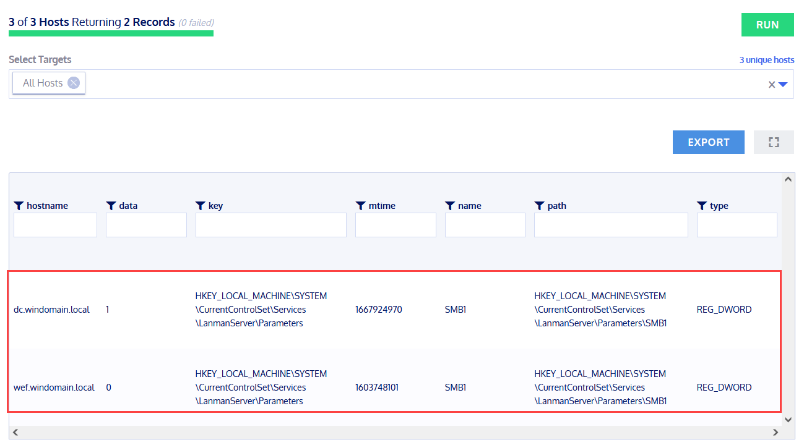

# Fleet Osquery Testing

## Recherche

**Was ist Fleet? Wofür wird es verwendet?**

Kolide Fleet war ein Open-Source OSQuery Fleet Manager, den Kolide Ende 2017 veröffentlichte. Dabei handelt es sich um einen Server, der zur Verwaltung von Osquery-Fleets verwendet werden kann. Mit Fleet können bei Bedarf mehrere Hosts abgefragt werden. Es können auch Abfragepakete und Zeitpläne erstellt werden.  
Am 4. November 2020 wurde Fleet von Kolide offiziell eingestellt. Der Grund dafür war, dass viele die Software für unmoralische Zwecke nutzten, welche die Privatsphäre der Endbenutzer nicht respektieren. Dabei gab es viel Nachfrage zur Datensammlung von:
* Webbrowser-Verläufe
* Geolocation von Geräten
* Inhalte von privaten Chat-Unterhaltungen
* Analyse der Produktivität der Endbenutzer (Welche Apps sind geöffnet? / Welche sind im Vordergrund? / Wann wurde die Maus zuletzt bewegt?)

Diese Verwendung ihrer Software war nicht mit den Werten von Kolide vereinbar. Deshalb entschieden sie sich die Entwicklung von Fleet einzustellen. Weitere Informationen zu diesem Entscheid gibt es [hier](https://www.kolide.com/blog/kolide-fleet-is-retired).

**Was ist die aktuellste Version von Fleet?**

Die aktuellste Version von Fleet ist [v3.2.0](https://github.com/kolide/fleet/releases/tag/3.2.0).

> [!Info]
> Am 4. November 2020 hat Kolide Fleet offiziell zurückgezogen. Das [GitHub-Repository](https://github.com/kolide/fleet) wird seither in einem archivierten Zustand für die Nachwelt hinterlassen und um bestehende Fleet-Nutzer zu unterstützen.

**Was sind Beispiel-Anwendungen/Use-Cases bei welchen Fleet helfen kann?**

Kolide Fleet konnte man gut für das Monitoring einer Infrastruktur einsetzen. Mit Fleet hat man nämlich eine einfache und intuitive Möglichkeit die Daten mittels SQL-Statements abzufragen. Das können beispielsweise installierte Software, laufende Prozesse oder auch Konfigurationen über die Registry sein. Kolide Fleet ist dafür nämlich sehr gut geeignet, denn es lassen sich neben den vorgefertigten Queries auch eigene Abfragen erstellen und gezielt auf bestimmte Computer oder Computer-Gruppen anwenden.

Da Kolide Fleet offiziell eingestellt wurde, wird die Nutzung der ursprünglichen Software nicht mehr empfohlen. Denn sie wurde seither nicht mehr aktualisiert und könnte ungepatchte Sicherheitslücken enthalten. Es gibt aber mittlerweile Alternativen dazu, welche als Fork der Kolide Fleet Software entstanden sind und immernoch weiterentwickelt werden. Ein Beispiel dazu wäre [FleetDM](https://fleetdm.com/).

## Dokumentation / Testing (1)

### Beschreibung

Für den ersten Test habe ich mich für die Query *smbv1_registry* entschieden.  
Mit dieser Abfrage wird überprüft, ob SMBv1 auf einem Server/Client aktiviert ist oder nicht. Dies kann anhand des Registry-Keys *HKEY_LOCAL_MACHINE\SYSTEM\CurrentControlSet\Services\LanmanServer\Parameters\SMB1* überprüft werden. Die Query selbst führt deshalb eine Abfrage auf alle Daten der Registry ab, welche dem oben genannten Pfad entsprechen.  
  
Der Registry-Key kann dabei folgende Werte enthalten:
* REG_DWORD: 0 = SMBv1 ist deaktiviert
* REG_DWORD: 1 = SMBv1 ist aktiviert
* Standard (kein Registry-Key): 1 = SMBv1 ist aktiviert


### Test Durchführung

Für den Test habe ich folgendes vorbereitet:

* Auf der *dc.windomain.local-VM* habe ich mit folgendem PowerShell-Befehl SMBv1 aktiviert:

```PowerShell
Set-SmbServerConfiguration -EnableSMB1Protocol $true
```

* Auf der *wef.windomain.local-VM* habe ich mit folgendem PowerShell-Befehl SMBv1 deaktiviert:

```PowerShell
Set-SmbServerConfiguration -EnableSMB1Protocol $false
```

* Auf der *win10.windomain.local-VM* habe ich die SMBv1 Einstellung beim Standard belassen (keinen Befehl ausgeführt, weshalb es keinen Registry-Key gibt).

Der Screenshot zeigt das Beispiel mit der *dc.windomain.local-VM*, bei der SMBv1 aktiviert wurde. Zu sehen sind der ausgeführte Befehl und der generierte Registry-Key:


Nachdem ich die Query auf alle 3 Windows-VMs ausgeführt habe, konnten zwei Resultate gefunden werden:

* Die *dc.windomain.local-VM*, welche den Wert 1 hat. Hier war SMBv1 aktiviert.
* Die *wef.windomain.local-VM*, welche den Wert 0 hat. Hier war SMBv1 deaktiviert.

Bei der *win10.windomain.local-VM* konnte kein Resultat gefunden werden. Der Grund dafür war, dass hier der Registry-Key gar nicht existierte und deshalb die Query auch nicht gegriffen hat.

> [!Info]
> Für solche Fälle wie bei der *win10.windomain.local-VM*, welche keinen Registry-Key haben, gibt es eine andere Query. Diese Query heisst *smbv1_registry_missing* und gibt aus, ob der Registry-Key überhaupt vorhanden ist. Die Query lautet hierbei: ```SELECT IFNULL(key_count,0) AS key_exists FROM (SELECT COUNT(*) AS key_count FROM registry WHERE path='HKEY_LOCAL_MACHINE\SYSTEM\CurrentControlSet\Services\LanmanServer\Parameters\SMB1') WHERE key_exists!=1;```.
  
Die Ergebnisse enthielten dabei folgende Daten: Hostname, Wert des Keys, Registry-Key, Zeit (zuletzt bearbeitet), Name, Pfad und Typ des Keys.



## Dokumentation / Testing (2)

### Beschreibung

Für den zweiten Test habe ich mich für die Query *services* entschieden.  
Mit dieser Abfrage wird überprüft, welche installierte Dienste beim Start des Computers automatisch gestartet werden.


Die Query führt hier eine Abfrage aller services aus, bei denen der Starttyp auf ```DEMAND_START``` oder ```AUTO_START``` gesetzt ist. Diese Starttypen können auch unter Services in der Spalte *Startup Type* eingesehen werden. Der ```DEMAND_START``` entspricht hierbei *Manual (Trigger Start)* und der ```AUTO_START``` entspricht *Automatic*:


### Test Durchführung

Für diesen Test musste ich keine besonderen Vorbereitungen treffen, da die Windows-VMs bereits genug Dienste installiert hatten und viele auch für den automatischen Start konfiguriert wurden.  
  
Den Test habe ich auf alle 3 Windows-VMs angewendet, was zu 623 Ergebnissen führte. Es wurden dabei folgende Daten ausgegeben: Hostname, Beschreibung, Anzeigename, Modul-Pfad, Names, Pfad, Service_Exit_Code, Service Typ, Starttyp, Status, Benutzerkonto und Win32_Exit_Code.


