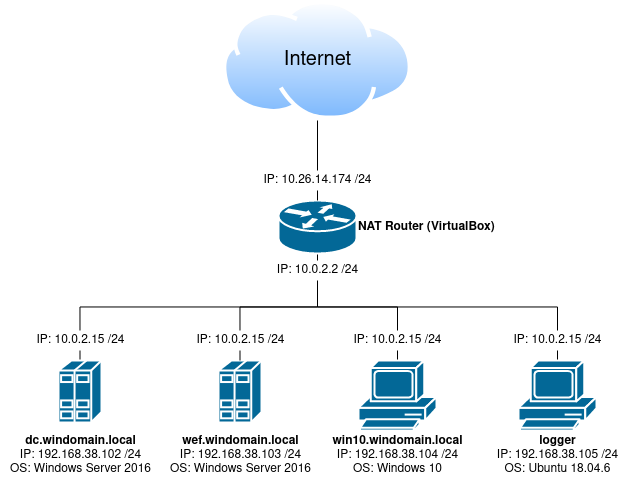

# Infrastruktur aufbauen, verstehen und dokumentieren

## Lab

### Netzwerk-Diagramm

Die VM-Infrastruktur sieht wie folgt aus:  


### dc.windomain.local

* OS: Windows Server 2016  
* Benutzername/Passwort: vagrant / vagrant
* Installierte Dienste:
  * WEF Server Configuration GPO
  * Powershell logging GPO
  * Enhanced Windows Auditing policy GPO
  * Sysmon
  * osquery
  * Elastic Beats Forwarder (Forwards Sysmon & osquery)
  * Sysinternals Tools
  * Microsft Advanced Threat Analytics Lightweight Gateway
  * Active Directory Domain Services
  * DNS
  * File and Storage Services
  * IIS
  * WSUS

### wef.windomain.local

* OS: Windows Server 2016  
* Benutzername/Passwort: vagrant / vagrant
* Installierte Dienste:
  * Microsoft Advanced Threat Analytics
  * Windows Event Collector
  * Windows Event Subscription Creation
  * Powershell transcription logging share
  * Sysmon
  * osquery
  * Elastic Beats Forwarder (Forwards WinEventLog & Powershell & Sysmon & osquery)
  * Sysinternals tools

### win10.windomain.local

* OS: Windows 10  
* Benutzername/Passwort: vagrant / vagrant
* Installierte Dienste:
  * Simulates employee workstation
  * Sysmon
  * osquery
  * Sysinternals Tools

### logger

* OS: Ubuntu 18.04.6  
* Benutzername/Passwort: vagrant / vagrant 
* Installierte Dienste:
  * Kibana
  * Fleet osquery Manager
  * Bro
  * Suricata
  * Elastic Beats Forwarder (Forwards Bro logs & Suricata & osquery)
  * Guacamole
  * Velociraptor

### Zugriffe auf die Applikationen

Folgende Liste zeigt, wie auf die verschiedenen Dienste zugegriffen werden kann. Der standard Benutzername und Passwort sind "vagrant".
* Fleet login: https://192.168.38.105:8412 - vagrant:vagrant
* Kibana login: http://192.168.38.105:5601 - vagrant:vagrant
* Microsoft ATA login: https://192.168.38.103 - vagrant:vagrant
* Guacamole login: http://192.168.38.105:8080/guacamole - vagrant:vagrant
* Velociraptor: https://192.168.38.105:9999 - vagrant:vagrant

## Setup

### Vagrantfile

Der Sinn eines Vagrantfiles ist es, eine vorgefertigte Konfiguration für VMs zu erstellen, um diese automatisiert installieren zu lassen. Die Vagrantfiles werden dabei in der Programmiersprache Ruby erfasst.  
Im Folgenden wird der grobe Aufbau des Vagrantfiles anhand einer VM erklärt:

Dieser Block definiert eine einzelne VM mit ihrem Namen. Alle Konfigurationen, welche zu dieser VM gehören, werden innerhalb dieses Blocks definiert. Es lassen sich auch mehrere VMs in einem einzelnen Vagrantfile konfigurieren, indem mehrere solcher Blöcke nacheinander gesetzt werden:
```ruby
config.vm.define "dc" do |cfg|

# Config...

end
```

Die Grundkonfiguration wie das Image (Box) und die Netzwerkeinstellungen werden hier gesetzt:
```ruby
  cfg.vm.box = "cyberdefenders/win2016"
  cfg.vm.hostname = "dc"
  cfg.vm.boot_timeout = 600
  cfg.winrm.transport = :plaintext
  cfg.vm.communicator = "winrm"
  cfg.winrm.basic_auth_only = true
  cfg.winrm.timeout = 300
  cfg.winrm.retry_limit = 20
  cfg.vm.network :private_network, ip: "192.168.38.102", gateway: "192.168.38.1"
```

Skripts und Befehle, welche bei der Installation ausgeführt werden:
```ruby
  cfg.vm.provision "shell", path: "scripts/fix-second-network.ps1", privileged: true, args: "-ip 192.168.38.102 -dns 8.8.8.8 -gateway 192.168.38.1" 
  cfg.vm.provision "shell", path: "scripts/provision.ps1", privileged: false
  cfg.vm.provision "reload"
  cfg.vm.provision "shell", path: "scripts/provision.ps1", privileged: false
  cfg.vm.provision "shell", path: "scripts/download_palantir_wef.ps1", privileged: false
  cfg.vm.provision "shell", path: "scripts/install-utilities.ps1", privileged: false
  cfg.vm.provision "shell", path: "scripts/install-redteam.ps1", privileged: false
  cfg.vm.provision "shell", path: "scripts/install-choco-extras.ps1", privileged: false
  cfg.vm.provision "shell", path: "scripts/install-osquery.ps1", privileged: false
  cfg.vm.provision "shell", path: "scripts/install-sysinternals.ps1", privileged: false
  cfg.vm.provision "shell", path: "scripts/install-velociraptor.ps1", privileged: false
  cfg.vm.provision "shell", path: "scripts/configure-ou.ps1", privileged: false
  cfg.vm.provision "shell", path: "scripts/configure-wef-gpo.ps1", privileged: false
  cfg.vm.provision "shell", path: "scripts/configure-powershelllogging.ps1", privileged: false
  cfg.vm.provision "shell", path: "scripts/configure-AuditingPolicyGPOs.ps1", privileged: false
  cfg.vm.provision "shell", path: "scripts/configure-rdp-user-gpo.ps1", privileged: false
  cfg.vm.provision "shell", path: "scripts/configure-disable-windows-defender-gpo.ps1", privileged: false
  cfg.vm.provision "shell", path: "scripts/install-autorunstowineventlog.ps1", privileged: false
  cfg.vm.provision "shell", inline: 'wevtutil el | Select-String -notmatch "Microsoft-Windows-LiveId" | Foreach-Object {wevtutil cl "$_"}', privileged: false
  cfg.vm.provision "shell", inline: "Set-SmbServerConfiguration -AuditSmb1Access $true -Force", privileged: false
  cfg.vm.provision "enable-public-winrm", type: "shell", path: "scripts/enable-winrm.ps1", privileged: false
  cfg.vm.provision "shell", inline: 'cscript c:\windows\system32\slmgr.vbs /dlv', privileged: false
```

VM-Konfiguration für VMware:
```ruby
  cfg.vm.provider "vmware_desktop" do |v, override|
    v.vmx["displayname"] = "dc.windomain.local"
    v.memory = 3072
    v.cpus = 2
    v.gui = false
    v.enable_vmrun_ip_lookup = false
  end
```

VM-Konfiguration für Virtualbox:
```ruby
  cfg.vm.provider "virtualbox" do |vb, override|
    vb.gui = false
    vb.name = "dc.windomain.local"
    vb.default_nic_type = "82545EM"
    vb.customize ["modifyvm", :id, "--memory", 3072]
    vb.customize ["modifyvm", :id, "--cpus", 2]
    vb.customize ["modifyvm", :id, "--vram", "32"]
    vb.customize ["modifyvm", :id, "--clipboard", "bidirectional"]
    vb.customize ["modifyvm", :id, "--natdnshostresolver1", "on"]
    vb.customize ["setextradata", "global", "GUI/SuppressMessages", "all" ]
  end
```

Das gesamte Vagrantfile mit allen konfigurierten VMs gäbe es noch hier:

<details>
  <summary>Hier klicken zum anzeigen: Vagrantfile</summary>

  ```ruby
  Vagrant.configure("2") do |config|

    config.vm.define "logger" do |cfg|
      cfg.vm.box = "bento/ubuntu-18.04"
      cfg.vm.hostname = "logger"
      cfg.vm.provision :shell, path: "bootstrap.sh"
      cfg.vm.provision :shell, path: "ELK.sh"
      cfg.vm.network :private_network, ip: "192.168.38.105", gateway: "192.168.38.1", dns: "8.8.8.8"

      cfg.vm.provider "vmware_desktop" do |v, override|
        v.vmx["displayname"] = "logger"
        v.memory = 4096
        v.cpus = 2
        v.gui = false
      end

      cfg.vm.provider "virtualbox" do |vb, override|
        vb.gui = false
        vb.name = "logger"
        vb.customize ["modifyvm", :id, "--memory", 4096]
        vb.customize ["modifyvm", :id, "--cpus", 2]
        vb.customize ["modifyvm", :id, "--vram", "32"]
        vb.customize ["modifyvm", :id, "--nicpromisc2", "allow-all"]
        vb.customize ["modifyvm", :id, "--clipboard", "bidirectional"]
        vb.customize ["modifyvm", :id, "--natdnshostresolver1", "on"]
        vb.customize ["setextradata", "global", "GUI/SuppressMessages", "all" ]
      end
    end


    config.vm.define "dc" do |cfg|
      cfg.vm.box = "cyberdefenders/win2016"
      cfg.vm.hostname = "dc"
      cfg.vm.boot_timeout = 600
      cfg.winrm.transport = :plaintext
      cfg.vm.communicator = "winrm"
      cfg.winrm.basic_auth_only = true
      cfg.winrm.timeout = 300
      cfg.winrm.retry_limit = 20
      cfg.vm.network :private_network, ip: "192.168.38.102", gateway: "192.168.38.1"

      cfg.vm.provision "shell", path: "scripts/fix-second-network.ps1", privileged: true, args: "-ip 192.168.38.102 -dns 8.8.8.8 -gateway 192.168.38.1" 
      cfg.vm.provision "shell", path: "scripts/provision.ps1", privileged: false
      cfg.vm.provision "reload"
      cfg.vm.provision "shell", path: "scripts/provision.ps1", privileged: false
      cfg.vm.provision "shell", path: "scripts/download_palantir_wef.ps1", privileged: false
      cfg.vm.provision "shell", path: "scripts/install-utilities.ps1", privileged: false
      cfg.vm.provision "shell", path: "scripts/install-redteam.ps1", privileged: false
      cfg.vm.provision "shell", path: "scripts/install-choco-extras.ps1", privileged: false
      cfg.vm.provision "shell", path: "scripts/install-osquery.ps1", privileged: false
      cfg.vm.provision "shell", path: "scripts/install-sysinternals.ps1", privileged: false
      cfg.vm.provision "shell", path: "scripts/install-velociraptor.ps1", privileged: false
      cfg.vm.provision "shell", path: "scripts/configure-ou.ps1", privileged: false
      cfg.vm.provision "shell", path: "scripts/configure-wef-gpo.ps1", privileged: false
      cfg.vm.provision "shell", path: "scripts/configure-powershelllogging.ps1", privileged: false
      cfg.vm.provision "shell", path: "scripts/configure-AuditingPolicyGPOs.ps1", privileged: false
      cfg.vm.provision "shell", path: "scripts/configure-rdp-user-gpo.ps1", privileged: false
      cfg.vm.provision "shell", path: "scripts/configure-disable-windows-defender-gpo.ps1", privileged: false
      cfg.vm.provision "shell", path: "scripts/install-autorunstowineventlog.ps1", privileged: false
      cfg.vm.provision "shell", inline: 'wevtutil el | Select-String -notmatch "Microsoft-Windows-LiveId" | Foreach-Object {wevtutil cl "$_"}', privileged: false
      cfg.vm.provision "shell", inline: "Set-SmbServerConfiguration -AuditSmb1Access $true -Force", privileged: false
      cfg.vm.provision "enable-public-winrm", type: "shell", path: "scripts/enable-winrm.ps1", privileged: false
      cfg.vm.provision "shell", inline: 'cscript c:\windows\system32\slmgr.vbs /dlv', privileged: false

      cfg.vm.provider "vmware_desktop" do |v, override|
        v.vmx["displayname"] = "dc.windomain.local"
        v.memory = 3072
        v.cpus = 2
        v.gui = false
        v.enable_vmrun_ip_lookup = false
      end

      cfg.vm.provider "virtualbox" do |vb, override|
        vb.gui = false
        vb.name = "dc.windomain.local"
        vb.default_nic_type = "82545EM"
        vb.customize ["modifyvm", :id, "--memory", 3072]
        vb.customize ["modifyvm", :id, "--cpus", 2]
        vb.customize ["modifyvm", :id, "--vram", "32"]
        vb.customize ["modifyvm", :id, "--clipboard", "bidirectional"]
        vb.customize ["modifyvm", :id, "--natdnshostresolver1", "on"]
        vb.customize ["setextradata", "global", "GUI/SuppressMessages", "all" ]
      end
    end

    config.vm.define "wef" do |cfg|
      cfg.vm.box = "cyberdefenders/win2016"
      cfg.vm.hostname = "wef"
      cfg.vm.boot_timeout = 600
      cfg.vm.communicator = "winrm"
      cfg.winrm.basic_auth_only = true
      cfg.winrm.timeout = 300
      cfg.winrm.retry_limit = 20
      cfg.vm.network :private_network, ip: "192.168.38.103", gateway: "192.168.38.1", dns: "192.168.38.102"

      cfg.vm.provision "shell", path: "scripts/fix-second-network.ps1", privileged: true, args: "-ip 192.168.38.103 -dns 8.8.8.8 -gateway 192.168.38.1" 
      cfg.vm.provision "shell", path: "scripts/provision.ps1", privileged: false
      cfg.vm.provision "reload"
      cfg.vm.provision "shell", path: "scripts/provision.ps1", privileged: false
      cfg.vm.provision "shell", path: "scripts/download_palantir_wef.ps1", privileged: false
      cfg.vm.provision "shell", inline: 'wevtutil el | Select-String -notmatch "Microsoft-Windows-LiveId" | Foreach-Object {wevtutil cl "$_"}', privileged: false
      cfg.vm.provision "shell", path: "scripts/install-wefsubscriptions.ps1", privileged: false
      # cfg.vm.provision "shell", path: "scripts/install-splunkuf.ps1", privileged: false
      # cfg.vm.provision "shell", path: "scripts/install-windows_ta.ps1", privileged: false
      cfg.vm.provision "shell", path: "scripts/install-utilities.ps1", privileged: false
      cfg.vm.provision "shell", path: "scripts/install-redteam.ps1", privileged: false
      cfg.vm.provision "shell", path: "scripts/install-choco-extras.ps1", privileged: false
      cfg.vm.provision "install-winlogbeat", type: "shell", path: "scripts/install-winlogbeat.ps1", privileged: false
      cfg.vm.provision "shell", path: "scripts/install-osquery.ps1", privileged: false
      cfg.vm.provision "shell", path: "scripts/install-sysinternals.ps1", privileged: false
      cfg.vm.provision "shell", path: "scripts/install-velociraptor.ps1", privileged: false
      cfg.vm.provision "shell", path: "scripts/configure-pslogstranscriptsshare.ps1", privileged: false
      cfg.vm.provision "shell", path: "scripts/install-autorunstowineventlog.ps1", privileged: false
      cfg.vm.provision "shell", inline: "Set-SmbServerConfiguration -AuditSmb1Access $true -Force", privileged: false
      cfg.vm.provision "shell", path: "scripts/install-microsoft-ata.ps1", privileged: false
      cfg.vm.provision "enable-public-winrm", type: "shell", path: "scripts/enable-winrm.ps1", privileged: false
      cfg.vm.provision "shell", inline: 'cscript c:\windows\system32\slmgr.vbs /dlv', privileged: false

      cfg.vm.provider "vmware_desktop" do |v, override|
        v.vmx["displayname"] = "wef.windomain.local"
        v.memory = 2048
        v.cpus = 2
        v.gui = false
        v.enable_vmrun_ip_lookup = false
      end

      cfg.vm.provider "virtualbox" do |vb, override|
        vb.gui = false
        vb.name = "wef.windomain.local"
        vb.default_nic_type = "82545EM"
        vb.customize ["modifyvm", :id, "--memory", 2048]
        vb.customize ["modifyvm", :id, "--cpus", 2]
        vb.customize ["modifyvm", :id, "--vram", "32"]
        vb.customize ["modifyvm", :id, "--clipboard", "bidirectional"]
        vb.customize ["modifyvm", :id, "--natdnshostresolver1", "on"]
        vb.customize ["setextradata", "global", "GUI/SuppressMessages", "all" ]
      end
    end

    config.vm.define "win10" do |cfg|
      cfg.vm.box = "cyberdefenders/win10"
      cfg.vm.hostname = "win10"
      cfg.vm.boot_timeout = 1200
      cfg.vm.communicator = "winrm"
      cfg.winrm.basic_auth_only = true
      cfg.winrm.timeout = 1200
      cfg.winrm.retry_limit = 20
      cfg.vm.network :private_network, ip: "192.168.38.104", gateway: "192.168.38.1", dns: "192.168.38.102"

      cfg.vm.provision "shell", path: "scripts/fix-second-network.ps1", privileged: true, args: "-ip 192.168.38.104 -dns 8.8.8.8 -gateway 192.168.38.1" 
      cfg.vm.provision "shell", path: "scripts/MakeWindows10GreatAgain.ps1", privileged: false
      cfg.vm.provision "shell", path: "scripts/provision.ps1", privileged: false
      cfg.vm.provision "reload"
      cfg.vm.provision "shell", path: "scripts/provision.ps1", privileged: false
      cfg.vm.provision "shell", path: "scripts/download_palantir_wef.ps1", privileged: false
      cfg.vm.provision "shell", inline: 'wevtutil el | Select-String -notmatch "Microsoft-Windows-LiveId" | Foreach-Object {wevtutil cl "$_"}', privileged: false
      cfg.vm.provision "shell", path: "scripts/install-utilities.ps1", privileged: false
      cfg.vm.provision "shell", path: "scripts/install-redteam.ps1", privileged: false
      cfg.vm.provision "shell", path: "scripts/install-choco-extras.ps1", privileged: false
      cfg.vm.provision "shell", path: "scripts/install-osquery.ps1", privileged: false
      cfg.vm.provision "shell", path: "scripts/install-sysinternals.ps1", privileged: false
      cfg.vm.provision "shell", path: "scripts/install-velociraptor.ps1", privileged: false
      cfg.vm.provision "shell", path: "scripts/install-autorunstowineventlog.ps1", privileged: false
      cfg.vm.provision "enable-public-winrm", type: "shell", path: "scripts/enable-winrm.ps1", privileged: false
      cfg.vm.provision "shell", inline: 'cscript c:\windows\system32\slmgr.vbs /dlv', privileged: false
      cfg.vm.provision "shell", inline: 'cscript c:\windows\system32\slmgr.vbs /rearm', privileged: false
      cfg.vm.provision "reload"

      cfg.vm.provider "vmware_desktop" do |v, override|
        v.vmx["displayname"] = "win10.windomain.local"
        v.vmx["gui.fullscreenatpoweron"] = "FALSE"
        v.vmx["gui.viewModeAtPowerOn"] = "windowed"
        v.memory = 2048
        v.cpus = 1
        v.gui = true
        v.enable_vmrun_ip_lookup = false
      end

      cfg.vm.provider "virtualbox" do |vb, override|
        vb.gui = false
        vb.name = "win10.windomain.local"
        vb.default_nic_type = "82545EM"
        vb.customize ["modifyvm", :id, "--memory", 2048]
        vb.customize ["modifyvm", :id, "--cpus", 2]
        vb.customize ["modifyvm", :id, "--vram", "32"]
        vb.customize ["modifyvm", :id, "--clipboard", "bidirectional"]
        vb.customize ["modifyvm", :id, "--natdnshostresolver1", "on"]
        vb.customize ["setextradata", "global", "GUI/SuppressMessages", "all" ]
      end
    end
  end
  ```

</details>

### Provisioning-Befehle

Provisioning Befehle werden im Vagrantfile erfasst und werden dazu eingesetzt, um Skripts oder andere Befehle zu definieren, welche bei der Installation der VM ausgeführt werden sollen.

Im Folgenden sieht man einen Provisioning-Befehl, der ein Skript für die Insatllation von OSQuery definiert. Der Parameter ```path```gibt dabei an, wo das Skript gespeichert ist und der Parameter ```privileged```gibt an, ob dieses Skript mit Administratorenrechte ausgeführt werden soll.

```ruby
cfg.vm.provision "shell", path: "scripts/install-osquery.ps1", privileged: false
```

> [!Info]
> Unter folgendem Link wird der Provisioning-Befehl noch genauer und mit allen Parametern erklärt: [Shell Provisioner](https://developer.hashicorp.com/vagrant/docs/provisioning/shell)


### Liste aller Scripts

Die folgende Liste enthält alle Scripts für die Windows-Images, welche bei der Installation ausgeführt werden:

**dc.windomain.local:**
* fix-second-network.ps1
* provision.ps1
* provision.ps1
* download_palantir_wef.ps1
* install-utilities.ps1
* install-redteam.ps1
* install-choco-extras.ps1
* install-osquery.ps1
* install-sysinternals.ps1
* install-velociraptor.ps1
* configure-ou.ps1
* configure-wef-gpo.ps1
* configure-powershelllogging.ps1
* configure-AuditingPolicyGPOs.ps1
* configure-rdp-user-gpo.ps1
* configure-disable-windows-defender-gpo.ps1
* install-autorunstowineventlog.ps1
* enable-winrm.ps1

**wef.windomain.local:**
* fix-second-network.ps1
* provision.ps1
* provision.ps1
* download_palantir_wef.ps1
* install-wefsubscriptions.ps1
* install-splunkuf.ps1
* install-windows_ta.ps1
* install-utilities.ps1
* install-redteam.ps1
* install-choco-extras.ps1
* install-winlogbeat.ps1
* install-osquery.ps1
* install-sysinternals.ps1
* install-velociraptor.ps1
* configure-pslogstranscriptsshare.ps1
* install-autorunstowineventlog.ps1
* install-microsoft-ata.ps1
* enable-winrm.ps1

**win10.windomain.local:**
* fix-second-network.ps1
* MakeWindows10GreatAgain.ps1
* provision.ps1
* provision.ps1
* download_palantir_wef.ps1
* install-utilities.ps1
* install-redteam.ps1
* install-choco-extras.ps1
* install-osquery.ps1
* install-sysinternals.ps1
* install-velociraptor.ps1
* install-autorunstowineventlog.ps1
* enable-winrm.ps1

### Beschreibung des bootstrap.sh-Files

Das Skript bootstrap.sh wird genutzt, um die Netzwerkkonfiguration und Softwareinstallation für die logger-VM durchzuführen. Die Main-Funktion des Skripts sieht wie folgt aus (Beschreibung in den Kommentaren):

```bash
main() {
  apt_install_prerequisites           # Fügt einige Repositories hinzu und führt Updates durch
  modify_motd                         # Anpassungen an Message of the Day
  test_prerequisites                  # Prüft ob die Pakete richtig installiert wurden
  #fix_eth1_static_ip                 # Wenn eth1 Probleme macht, kann hierrüber einen statischen DHCP-Lease gesetzt werden
  download_palantir_osquery_config    # Lädt Palantir OSQuery Konfiguration herunter
  install_fleet_import_osquery_config # Installation von Fleet OSQuery
  install_velociraptor                # Installation von Velociraptor
  install_suricata                    # Installation von Suricata
  install_zeek                        # Installation von Zeek
  install_guacamole                   # Installation von Guacamole
  postinstall_tasks                   # Auszuführende Tasks nach der Installation
}
```

Das gesamte bootstrap.sh Skript gäbe es noch hier:

<details>
  <summary>Hier klicken zum anzeigen: bootstrap.sh</summary>

  ```bash
  #! /bin/bash

  # Override existing DNS Settings using netplan, but don't do it for Terraform builds
  if ! curl -s 169.254.169.254 --connect-timeout 2 >/dev/null; then
    echo -e "    eth1:\n      dhcp4: true\n      nameservers:\n        addresses: [8.8.8.8,8.8.4.4]" >>/etc/netplan/01-netcfg.yaml
    netplan apply
  fi
  sed -i 's/nameserver 127.0.0.53/nameserver 8.8.8.8/g' /etc/resolv.conf && chattr +i /etc/resolv.conf

  export DEBIAN_FRONTEND=noninteractive
  echo "apt-fast apt-fast/maxdownloads string 10" | debconf-set-selections
  echo "apt-fast apt-fast/dlflag boolean true" | debconf-set-selections

  # sed -i "2ideb mirror://mirrors.ubuntu.com/mirrors.txt bionic main restricted universe multiverse\ndeb mirror://mirrors.ubuntu.com/mirrors.txt bionic-updates main restricted universe multiverse\ndeb mirror://mirrors.ubuntu.com/mirrors.txt bionic-backports main restricted universe multiverse\ndeb mirror://mirrors.ubuntu.com/mirrors.txt bionic-security main restricted universe multiverse" /etc/apt/sources.list

  apt_install_prerequisites() {
    echo "[$(date +%H:%M:%S)]: Adding apt repositories..."
    # Add repository for apt-fast
    add-apt-repository -y ppa:apt-fast/stable
    # Add repository for yq
    add-apt-repository -y ppa:rmescandon/yq
    # Add repository for suricata
    add-apt-repository -y ppa:oisf/suricata-stable
    # Install prerequisites and useful tools
    echo "[$(date +%H:%M:%S)]: Running apt-get clean..."
    apt-get clean
    echo "[$(date +%H:%M:%S)]: Running apt-get update..."
    apt-get -qq update
    apt-get -qq install -y apt-fast
    echo "[$(date +%H:%M:%S)]: Running apt-fast install..."
    apt-fast -qq install -y jq whois build-essential git unzip htop yq mysql-server redis-server python-pip
  }

  modify_motd() {
    echo "[$(date +%H:%M:%S)]: Updating the MOTD..."
    # Force color terminal
    sed -i 's/#force_color_prompt=yes/force_color_prompt=yes/g' /root/.bashrc
    sed -i 's/#force_color_prompt=yes/force_color_prompt=yes/g' /home/vagrant/.bashrc
    # Remove some stock Ubuntu MOTD content
    chmod -x /etc/update-motd.d/10-help-text
    # Copy the DetectionLab MOTD
    cp /vagrant/resources/logger/20-detectionlab /etc/update-motd.d/
    chmod +x /etc/update-motd.d/20-detectionlab
  }

  test_prerequisites() {
    for package in jq whois build-essential git unzip yq mysql-server redis-server python-pip; do
      echo "[$(date +%H:%M:%S)]: [TEST] Validating that $package is correctly installed..."
      # Loop through each package using dpkg
      if ! dpkg -S $package >/dev/null; then
        # If which returns a non-zero return code, try to re-install the package
        echo "[-] $package was not found. Attempting to reinstall."
        apt-get -qq update && apt-get install -y $package
        if ! which $package >/dev/null; then
          # If the reinstall fails, give up
          echo "[X] Unable to install $package even after a retry. Exiting."
          exit 1
        fi
      else
        echo "[+] $package was successfully installed!"
      fi
    done
  }

  fix_eth1_static_ip() {
    USING_KVM=$(sudo lsmod | grep kvm)
    if [ ! -z "$USING_KVM" ]; then
      echo "[*] Using KVM, no need to fix DHCP for eth1 iface"
      return 0
    fi
    # There's a fun issue where dhclient keeps messing with eth1 despite the fact
    # that eth1 has a static IP set. We workaround this by setting a static DHCP lease.
    echo -e 'interface "eth1" {
      send host-name = gethostname();
      send dhcp-requested-address 192.168.38.105;
    }' >>/etc/dhcp/dhclient.conf
    netplan apply
    # Fix eth1 if the IP isn't set correctly
    ETH1_IP=$(ip -4 addr show eth1 | grep -oP '(?<=inet\s)\d+(\.\d+){3}')
    if [ "$ETH1_IP" != "192.168.38.105" ]; then
      echo "Incorrect IP Address settings detected. Attempting to fix."
      ifdown eth1
      ip addr flush dev eth1
      ifup eth1
      ETH1_IP=$(ifconfig eth1 | grep 'inet addr' | cut -d ':' -f 2 | cut -d ' ' -f 1)
      if [ "$ETH1_IP" == "192.168.38.105" ]; then
        echo "[$(date +%H:%M:%S)]: The static IP has been fixed and set to 192.168.38.105"
      else
        echo "[$(date +%H:%M:%S)]: Failed to fix the broken static IP for eth1. Exiting because this will cause problems with other VMs."
        exit 1
      fi
    fi

    # Make sure we do have a DNS resolution
    while true; do
      if [ "$(dig +short @8.8.8.8 github.com)" ]; then break; fi
      sleep 1
    done
  }

  download_palantir_osquery_config() {
    if [ -f /opt/osquery-configuration ]; then
      echo "[$(date +%H:%M:%S)]: osquery configs have already been downloaded"
    else
      # Import Palantir osquery configs into Fleet
      echo "[$(date +%H:%M:%S)]: Downloading Palantir osquery configs..."
      cd /opt && git clone https://github.com/palantir/osquery-configuration.git
    fi
  }

  install_fleet_import_osquery_config() {
    if [ -f "/opt/fleet" ]; then
      echo "[$(date +%H:%M:%S)]: Fleet is already installed"
    else
      cd /opt || exit 1

      echo "[$(date +%H:%M:%S)]: Installing Fleet..."
      echo -e "\n127.0.0.1       kolide" >>/etc/hosts
      echo -e "\n127.0.0.1       logger" >>/etc/hosts

      mysql -uroot -e "ALTER USER 'root'@'localhost' IDENTIFIED WITH mysql_native_password BY 'kolide';"
      mysql -uroot -pkolide -e "create database kolide;"

      wget --progress=bar:force https://github.com/kolide/fleet/releases/download/3.0.0/fleet.zip
      unzip fleet.zip -d fleet
      cp fleet/linux/fleetctl /usr/local/bin/fleetctl && chmod +x /usr/local/bin/fleetctl
      cp fleet/linux/fleet /usr/local/bin/fleet && chmod +x /usr/local/bin/fleet

      fleet prepare db --mysql_address=127.0.0.1:3306 --mysql_database=kolide --mysql_username=root --mysql_password=kolide

      cp /vagrant/resources/fleet/server.* /opt/fleet/
      cp /vagrant/resources/fleet/fleet.service /etc/systemd/system/fleet.service

      mkdir /var/log/kolide

      /bin/systemctl enable fleet.service
      /bin/systemctl start fleet.service

      echo "[$(date +%H:%M:%S)]: Waiting for fleet service..."
      # while true; do
      #   result=$(curl --silent -k https://192.168.38.105:8412)
      #   if echo $result | grep -q setup; then break; fi
      #   sleep 1
      # done

      fleetctl config set --address https://192.168.38.105:8412
      fleetctl config set --tls-skip-verify true
      fleetctl setup --email info@cyberdefenders.org --username vagrant --password vagrant --org-name DetectionLabELK
      fleetctl login --email info@cyberdefenders.org --password vagrant

      # Set the enrollment secret to match what we deploy to Windows hosts
      mysql -uroot --password=kolide -e 'use kolide; update enroll_secrets set secret = "enrollmentsecret" where active=1;'
      echo "Updated enrollment secret"

      # Change the query invervals to reflect a lab environment
      # Every hour -> Every 3 minutes
      # Every 24 hours -> Every 15 minutes
      sed -i 's/interval: 3600/interval: 180/g' osquery-configuration/Fleet/Endpoints/MacOS/osquery.yaml
      sed -i 's/interval: 3600/interval: 180/g' osquery-configuration/Fleet/Endpoints/Windows/osquery.yaml
      sed -i 's/interval: 28800/interval: 900/g' osquery-configuration/Fleet/Endpoints/MacOS/osquery.yaml
      sed -i 's/interval: 28800/interval: 900/g' osquery-configuration/Fleet/Endpoints/Windows/osquery.yaml

      # Don't log osquery INFO messages
      # Fix snapshot event formatting
      fleetctl get options >/tmp/options.yaml
      /usr/bin/yq w -i /tmp/options.yaml 'spec.config.options.logger_snapshot_event_type' 'true'
      sed -i 's/kind: option/kind: options/g' /tmp/options.yaml
      fleetctl apply -f /tmp/options.yaml

      # Use fleetctl to import YAML files
      fleetctl apply -f osquery-configuration/Fleet/Endpoints/MacOS/osquery.yaml
      fleetctl apply -f osquery-configuration/Fleet/Endpoints/Windows/osquery.yaml
      for pack in osquery-configuration/Fleet/Endpoints/packs/*.yaml; do
        fleetctl apply -f "$pack"
      done
    fi
  }

  install_zeek() {
    echo "[$(date +%H:%M:%S)]: Installing Zeek..."
    # Environment variables
    NODECFG=/opt/zeek/etc/node.cfg
    touch /opt/zeek/etc/node.cfg
    touch /opt/zeek/share/zeek/site/local.zeek
    # SPLUNK_ZEEK_JSON=/opt/splunk/etc/apps/Splunk_TA_bro
    # SPLUNK_ZEEK_MONITOR='monitor:///opt/zeek/spool/manager'
    # SPLUNK_SURICATA_MONITOR='monitor:///var/log/suricata'
    # SPLUNK_SURICATA_SOURCETYPE='json_suricata'
    sh -c "echo 'deb http://download.opensuse.org/repositories/security:/zeek/xUbuntu_18.04/ /' > /etc/apt/sources.list.d/security:zeek.list"
    wget -nv https://download.opensuse.org/repositories/security:zeek/xUbuntu_18.04/Release.key -O /tmp/Release.key
    apt-key add - </tmp/Release.key &>/dev/null
    # Update APT repositories
    apt-get -qq -ym update
    # Install tools to build and configure Zeek
    apt-get -qq -ym install zeek crudini
    export PATH=$PATH:/opt/zeek/bin
    pip install zkg==2.1.1
    zkg refresh
    zkg autoconfig
    zkg install --force salesforce/ja3
    # Load Zeek scripts
    echo '
    @load protocols/ftp/software
    @load protocols/smtp/software
    @load protocols/ssh/software
    @load protocols/http/software
    @load tuning/json-logs
    @load policy/integration/collective-intel
    @load policy/frameworks/intel/do_notice
    @load frameworks/intel/seen
    @load frameworks/intel/do_notice
    @load frameworks/files/hash-all-files
    @load base/protocols/smb
    @load policy/protocols/conn/vlan-logging
    @load policy/protocols/conn/mac-logging
    @load ja3

    redef Intel::read_files += {
      "/opt/zeek/etc/intel.dat"
    };
    ' >>/opt/zeek/share/zeek/site/local.zeek

    # Configure Zeek
    crudini --del $NODECFG zeek
    crudini --set $NODECFG manager type manager
    crudini --set $NODECFG manager host localhost
    crudini --set $NODECFG proxy type proxy
    crudini --set $NODECFG proxy host localhost

    # Setup $CPUS numbers of Zeek workers
    crudini --set $NODECFG worker-eth1 type worker
    crudini --set $NODECFG worker-eth1 host localhost
    crudini --set $NODECFG worker-eth1 interface eth1
    crudini --set $NODECFG worker-eth1 lb_method pf_ring
    crudini --set $NODECFG worker-eth1 lb_procs "$(nproc)"

    # Setup Zeek to run at boot
    cp /vagrant/resources/zeek/zeek.service /lib/systemd/system/zeek.service
    systemctl enable zeek
    systemctl start zeek

    # Verify that Zeek is running
    # if ! pgrep -f zeek >/dev/null; then
    #   echo "Zeek attempted to start but is not running. Exiting"
    #   exit 1
    # fi
  }

  install_velociraptor() {
    echo "[$(date +%H:%M:%S)]: Installing Velociraptor..."
    if [ ! -d "/opt/velociraptor" ]; then
      mkdir /opt/velociraptor
    fi
    echo "[$(date +%H:%M:%S)]: Attempting to determine the URL for the latest release of Velociraptor"
    LATEST_VELOCIRAPTOR_LINUX_URL=$(curl -sL https://github.com/Velocidex/velociraptor/releases/latest | grep linux-amd64 | grep href | head -1 | cut -d '"' -f 2 | sed 's#^#https://github.com#g')
    echo "[$(date +%H:%M:%S)]: The URL for the latest release was extracted as $LATEST_VELOCIRAPTOR_LINUX_URL"
    echo "[$(date +%H:%M:%S)]: Attempting to download..."
    wget -P /opt/velociraptor --progress=bar:force "$LATEST_VELOCIRAPTOR_LINUX_URL"
    if [ "$(file /opt/velociraptor/velociraptor*linux-amd64 | grep -c 'ELF 64-bit LSB executable')" -eq 1 ]; then
      echo "[$(date +%H:%M:%S)]: Velociraptor successfully downloaded!"
    else
      echo "[$(date +%H:%M:%S)]: Failed to download the latest version of Velociraptor. Please open a DetectionLab issue on Github."
      return
    fi

    cd /opt/velociraptor || exit 1
    mv velociraptor-*-linux-amd64 velociraptor
    chmod +x velociraptor
    cp /vagrant/resources/velociraptor/server.config.yaml /opt/velociraptor
    echo "[$(date +%H:%M:%S)]: Creating Velociraptor dpkg..."
    ./velociraptor --config /opt/velociraptor/server.config.yaml debian server

    echo "[$(date +%H:%M:%S)]: Installing the dpkg..."
    if dpkg -i velociraptor_*_server.deb >/dev/null; then
      echo "[$(date +%H:%M:%S)]: Installation complete!"
    else
      echo "[$(date +%H:%M:%S)]: Failed to install the dpkg"
      return
    fi

    echo "[$(date +%H:%M:%S)]: Creating admin user..."
    sudo -u velociraptor ./velociraptor --config /opt/velociraptor/server.config.yaml user add --role administrator vagrant vagrant
    rm -rf /opt/velociraptor/users/admin.db /opt/velociraptor/acl/admin.json.db
  }

  install_suricata() {
    # Run iwr -Uri testmyids.com -UserAgent "BlackSun" in Powershell to generate test alerts from Windows
    echo "[$(date +%H:%M:%S)]: Installing Suricata..."

    # Install suricata
    apt-get -qq -y install suricata crudini
    test_suricata_prerequisites
    # Install suricata-update
    cd /opt || exit 1
    git clone https://github.com/OISF/suricata-update.git
    cd /opt/suricata-update || exit 1
    pip install pyyaml
    python setup.py install

    cp /vagrant/resources/suricata/suricata.yaml /etc/suricata/suricata.yaml
    crudini --set --format=sh /etc/default/suricata '' iface eth1
    # update suricata signature sources
    suricata-update update-sources
    # disable protocol decode as it is duplicative of Zeek
    echo re:protocol-command-decode >>/etc/suricata/disable.conf
    # enable et-open and attackdetection sources
    suricata-update enable-source et/open
    suricata-update enable-source ptresearch/attackdetection

    # Update suricata and restart
    suricata-update
    service suricata stop
    service suricata start
    sleep 3

    # Verify that Suricata is running
    if ! pgrep -f suricata >/dev/null; then
      echo "Suricata attempted to start but is not running. Exiting"
      exit 1
    fi

    cat >/etc/logrotate.d/suricata <<EOF
  /var/log/suricata/*.log /var/log/suricata/*.json
  {
      hourly
      rotate 0
      missingok
      nocompress
      size=500M
      sharedscripts
      postrotate
              /bin/kill -HUP \`cat /var/run/suricata.pid 2>/dev/null\` 2>/dev/null || true
      endscript
  }
  EOF
  }

  test_suricata_prerequisites() {
    for package in suricata crudini; do
      echo "[$(date +%H:%M:%S)]: [TEST] Validating that $package is correctly installed..."
      # Loop through each package using dpkg
      if ! dpkg -S $package >/dev/null; then
        # If which returns a non-zero return code, try to re-install the package
        echo "[-] $package was not found. Attempting to reinstall."
        apt-get clean && apt-get -qq update && apt-get install -y $package
        if ! which $package >/dev/null; then
          # If the reinstall fails, give up
          echo "[X] Unable to install $package even after a retry. Exiting."
          exit 1
        fi
      else
        echo "[+] $package was successfully installed!"
      fi
    done
  }

  install_guacamole() {
    echo "[$(date +%H:%M:%S)]: Installing Guacamole..."
    cd /opt || exit 1
    apt-get -qq install -y libcairo2-dev libjpeg62-dev libpng-dev libossp-uuid-dev libfreerdp-dev libpango1.0-dev libssh2-1-dev libssh-dev tomcat8 tomcat8-admin tomcat8-user
    wget --progress=bar:force "http://apache.org/dyn/closer.cgi?action=download&filename=guacamole/1.0.0/source/guacamole-server-1.0.0.tar.gz" -O guacamole-server-1.0.0.tar.gz
    tar -xf guacamole-server-1.0.0.tar.gz && cd guacamole-server-1.0.0 || echo "[-] Unable to find the Guacamole folder."
    ./configure &>/dev/null && make --quiet &>/dev/null && make --quiet install &>/dev/null || echo "[-] An error occurred while installing Guacamole."
    ldconfig
    cd /var/lib/tomcat8/webapps || echo "[-] Unable to find the tomcat8/webapps folder."
    wget --progress=bar:force "http://apache.org/dyn/closer.cgi?action=download&filename=guacamole/1.0.0/binary/guacamole-1.0.0.war" -O guacamole.war
    mkdir /etc/guacamole
    mkdir /usr/share/tomcat8/.guacamole
    cp /vagrant/resources/guacamole/user-mapping.xml /etc/guacamole/
    cp /vagrant/resources/guacamole/guacamole.properties /etc/guacamole/
    cp /vagrant/resources/guacamole/guacd.service /lib/systemd/system
    sudo ln -s /etc/guacamole/guacamole.properties /usr/share/tomcat8/.guacamole/
    sudo ln -s /etc/guacamole/user-mapping.xml /usr/share/tomcat8/.guacamole/
    chown tomcat8 /etc/guacamole/user-mapping.xml

    systemctl enable guacd
    systemctl enable tomcat8
    systemctl start guacd
    systemctl start tomcat8
  }

  postinstall_tasks() {
    # Include Splunk and Zeek in the PATH
    echo export PATH="$PATH:/opt/zeek/bin" >>~/.bashrc
    # Ping DetectionLab server for usage statistics
    # curl -A "DetectionLab-logger" "https://cyberdefenders.org/logger"
  }

  main() {
    apt_install_prerequisites
    modify_motd
    test_prerequisites
    #fix_eth1_static_ip
    download_palantir_osquery_config
    install_fleet_import_osquery_config
    install_velociraptor
    install_suricata
    install_zeek
    install_guacamole
    postinstall_tasks
  }

  main
  exit 0
  ```

</details>

### Beschreibung des ELK.sh-Files

Das Skript ELK.sh ist für die Installation und Konfiguration von ELK zuständig.
1. Als erstes wird die Software installiert.
2. Dann wird die Konfiguration der einzelnen Dienste in folgenden Dateien gesetzt:
   * /etc/elasticsearch/elasticsearch.yml
   * /etc/kibana/kibana.yml
   * /etc/filebeat/filebeat.yml
   * /etc/auditbeat/auditbeat.yml
3. Zum Schluss werden die Dienste gestartet und auch so konfiguriert, dass sie beim Systemstart automatisch gestartet werden:
   * elasticsearch.service
   * kibana.service
   * filebeat.service
   * auditbeat.service

Das gesamte ELK.sh Skript gäbe es noch hier:

<details>
  <summary>Hier klicken zum anzeigen: ELK.sh</summary>

  ```bash
  #!/bin/bash

  wget -qO - https://artifacts.elastic.co/GPG-KEY-elasticsearch | sudo apt-key add -
  echo "deb https://artifacts.elastic.co/packages/7.x/apt stable main" | sudo tee -a /etc/apt/sources.list.d/elastic-7.x.list
  echo "deb [arch=amd64] https://packages.elastic.co/curator/5/debian stable main" | sudo tee -a /etc/apt/sources.list.d/curator-5.list
  apt-get -qq update
  apt-get -qq install elasticsearch -y # 1st install elasticseatch to get JDK
  export JAVA_HOME=/usr/share/elasticsearch/jdk && echo export JAVA_HOME=/usr/share/elasticsearch/jdk >>/etc/bash.bashrc
  apt-get -qq install kibana filebeat auditbeat elasticsearch-curator -y

  cat >/etc/cron.daily/curator <<EOF
  #!/bin/sh
  curator_cli --host 192.168.38.105 delete_indices --filter_list '{"filtertype": "age", "source": "name", "timestring": "%Y.%m.%d", "unit": "days", "unit_count": 1, "direction": "older"}'  > /dev/null 2>&1
  EOF
  chmod +x /etc/cron.daily/curator

  printf vagrant | /usr/share/elasticsearch/bin/elasticsearch-keystore add -x "bootstrap.password" -f
  /usr/share/elasticsearch/bin/elasticsearch-users useradd vagrant -p vagrant -r superuser

  cat >/etc/elasticsearch/elasticsearch.yml <<EOF
  network.host: _eth1:ipv4_
  discovery.type: single-node
  cluster.name: cydef-es-cluster
  node.name: \${HOSTNAME}
  path.data: /var/lib/elasticsearch
  path.logs: /var/log/elasticsearch
  xpack.security.enabled: true
  xpack.security.authc:
          api_key.enabled: true
          anonymous:
                  username: anonymous
                  roles: superuser
                  authz_exception: false
  EOF

  cat >/etc/default/elasticsearch <<EOF
  ES_PATH_CONF=/etc/elasticsearch
  ES_STARTUP_SLEEP_TIME=5
  MAX_OPEN_FILES=65536
  MAX_LOCKED_MEMORY=unlimited
  EOF

  mkdir /etc/systemd/system/elasticsearch.service.d/
  cat >/etc/systemd/system/elasticsearch.service.d/override.conf <<EOF
  [Service]
  LimitMEMLOCK=infinity
  EOF

  cat >/etc/security/limits.conf <<EOF
  elasticsearch soft nofile 65536
  elasticsearch hard nofile 65536
  elasticsearch soft memlock unlimited
  elasticsearch hard memlock unlimited
  EOF

  /bin/systemctl daemon-reload
  /bin/systemctl enable elasticsearch.service
  /bin/systemctl start elasticsearch.service

  #kibana
  touch /var/log/kibana.log
  chown kibana:kibana /var/log/kibana.log
  cat >/etc/kibana/kibana.yml <<EOF
  server.host: "192.168.38.105"
  elasticsearch.hosts: ["http://192.168.38.105:9200"]
  logging.dest: "/var/log/kibana.log"
  kibana.defaultAppId: "discover"
  telemetry.enabled: false
  telemetry.optIn: false
  newsfeed.enabled: false
  xpack.security.enabled: true
  xpack.ingestManager.fleet.tlsCheckDisabled: true
  xpack.encryptedSavedObjects.encryptionKey: 'fhjskloppd678ehkdfdlliverpoolfcr'
  EOF

  /bin/systemctl enable kibana.service
  /bin/systemctl start kibana.service

  cat >/etc/filebeat/filebeat.yml <<EOF
  filebeat.inputs:
  - type: log
    enabled: false
    paths:
      - /var/log/auth.log
      - /var/log/syslog

  filebeat.config.modules:
    path: \${path.config}/modules.d/*.yml
    reload.enabled: true
    reload.period: 10s

  setup.kibana:
    host: "192.168.38.105:5601"
    username: vagrant
    password: vagrant

  setup.dashboards.enabled: true
  setup.ilm.enabled: false

  output.elasticsearch:
    hosts: ["192.168.38.105:9200"]
  EOF

  cat >/etc/filebeat/modules.d/osquery.yml.disabled <<EOF
  - module: osquery
    result:
      enabled: true

      # Set custom paths for the log files. If left empty,
      # Filebeat will choose the paths depending on your OS.
      var.paths: ["/var/log/kolide/osquery_result"]
  EOF
  filebeat --path.config /etc/filebeat modules enable osquery

  cat >/etc/auditbeat/auditbeat.yml <<EOF
  auditbeat.config.modules:
    path: \${path.config}/modules.d/*.yml
    reload.period: 10s
    reload.enabled: true
  auditbeat.max_start_delay: 10s

  auditbeat.modules:
  - module: auditd
    audit_rule_files: [ '\${path.config}/audit.rules.d/*.conf' ]
    audit_rules: |
  - module: file_integrity
    paths:
    - /bin
    - /usr/bin
    - /sbin
    - /usr/sbin
    - /etc
  - module: system
    state.period: 12h
    user.detect_password_changes: true
    login.wtmp_file_pattern: /var/log/wtmp*
    login.btmp_file_pattern: /var/log/btmp*
  setup.template.settings:
    index.number_of_shards: 1
  setup.kibana:
    host: "192.168.38.105:5601"
    username: vagrant
    password: vagrant

  setup.dashboards.enabled: true
  setup.ilm.enabled: false

  output.elasticsearch:
    hosts: ["192.168.38.105:9200"]
  processors:
    - add_host_metadata: ~
    - add_cloud_metadata: ~
    - add_docker_metadata: ~
  EOF
  mv /etc/auditbeat/audit.rules.d/sample-rules.conf.disabled /etc/auditbeat/audit.rules.d/sample-rules.conf

  mkdir /var/log/bro/
  ln -s /opt/zeek/logs/current/ /var/log/bro/current
  filebeat --path.config /etc/filebeat modules enable zeek

  filebeat --path.config /etc/filebeat modules enable suricata

  # make sure kibana is up and running
  echo "Waiting for Kibana to be up..."
  while true; do
    result=$(curl -uvagrant:vagrant --silent 192.168.38.105:5601/api/status)
    if echo $result | grep -q logger; then break; fi
    sleep 1
  done
  /bin/systemctl enable filebeat.service
  /bin/systemctl start filebeat.service

  /bin/systemctl enable auditbeat.service
  /bin/systemctl start auditbeat.service

  # load SIEM prebuilt rules
  echo "Load SIEM prebuilt rules"
  curl -s -uvagrant:vagrant -XPOST "192.168.38.105:5601/api/detection_engine/index" -H 'kbn-xsrf: true' -H 'Content-Type: application/json'
  curl -s -uvagrant:vagrant -XPUT "192.168.38.105:5601/api/detection_engine/rules/prepackaged" -H 'kbn-xsrf: true' -H 'Content-Type: application/json'

  # Enable elasticsearch trial
  # echo "Enable elastic trial version"
  # curl -s -XPOST "192.168.38.105:9200/_license/start_trial?acknowledge=true&pretty"
  ```

</details>
