# Installation Winlogbeat

## Recherche

**Was ist Winlogbeat? Wofür wird es verwendet?**

Winlogbeat ist ein Tool, welches Windows-Ereignisprotokolle an Elasticsearch oder Logstash sendet. Dieser kann als Windows-Dienst installiert werden.  
Winlogbeat liest mithilfe von Windows-APIs Ereignisprotokolle aus, filtert die Ereignisse basierend auf vom Benutzer konfigurierten Kriterien und sendet dann die Ereignisdaten an die konfigurierten Ausgänge (Elasticsearch oder Logstash). Winlogbeat überwacht dabei die Ereignisprotokolle, damit neue Ereignisdaten rechtzeitig gesendet werden.

Winlogbeat kann Ereignisdaten aus allen Ereignisprotokollen erfassen, die auf dem System ausgeführt werden. Beispiele für solche Ereignisse sind:
* Anwendungsereignisse
* Hardware-Ereignisse
* Sicherheitsereignisse
* Systemereignisse

Neben Winlogbeat gibt es auch noch andere Beat-Software, welche je nach Anwendungsfall diese Rolle übernehmen können. Dies ist eine Liste von anderen Beats:

| Beat | Beschreibung |
|:--|:--|
| [Auditbeat](https://github.com/elastic/beats/tree/main/auditbeat) | Sammeln Linux-Audit-Framework-Daten und überwacht die Integrität der Dateien |
| [Filebeat](https://github.com/elastic/beats/tree/main/filebeat) | Übermittelt Logdateien |
| [Functionbeat](https://github.com/elastic/beats/tree/main/x-pack/functionbeat) | Liest und versenden Ereignisse aus serverlosen Infrastrukturen |
| [Heartbeat](https://github.com/elastic/beats/tree/main/heartbeat) | Pingt Remote-Dienste auf ihre Verfügbarkeit |
| [Metricbeat](https://github.com/elastic/beats/tree/main/metricbeat) | Ruft Metriken aus dem Betriebssystem und Diensten ab |
| [Packetbeat](https://github.com/elastic/beats/tree/main/packetbeat) | Überwacht das Netzwerk und Anwendungen durch Sniffing von Paketen |
| [Winlogbeat](https://github.com/elastic/beats/tree/main/winlogbeat) | Ruft Windows-Ereignisprotokolle ab und versendet sie |

Die Downloads der verschiedenen Beats gibt es [hier](https://www.elastic.co/de/downloads/beats/).

**Was ist die aktuellste Version von Winlogbeat?**

Die aktuellste Version von Winlogbeat ist [v8.5.3](https://www.elastic.co/de/downloads/beats/winlogbeat)

## Installation / Konfiguration

### Installation

> [!Info]
> Die Installation habe ich auf der win10.windomain.local VM durchgeführt. Dabei wurde folgende [Anleitung](https://www.elastic.co/guide/en/beats/winlogbeat/master/winlogbeat-installation-configuration.html) (Self-managed) verwendet.

1. Zuerst habe ich das Winlogbeat.zip herunterladen: [Download Winlogbeat](https://www.elastic.co/de/downloads/beats/winlogbeat)

2. Dann habe ich den Inhalt der ZIP-Datei nach *C:\Program Files* extrahiert.

3. Den Ordner *winlogbeat-\<version\>* habe ich dann nach *Winlogbeat* umbenannt.

4. Dann habe ich PowerShell als Administrator geöffnen und folgende Befehle ausführen, um den Winlogbeat-Dienst zu installieren:

```PowerShell
cd 'C:\Program Files\Winlogbeat'
.\install-service-winlogbeat.ps1
```


> [!Warning]
> Sollte das Ausführen von Skripten auf dem System deaktiviert sein, kann dies mit folgendem Befehl aktiviert werden.  
> ```PowerShell.exe -ExecutionPolicy UnRestricted -File .\install-service-winlogbeat.ps1```

### Konfiguration

1. Es muss eine Verbindung von Winlogbeat zu Elasticsearch und Kibana hergestellt werden. Dazu passte ich in der Konfigurationsdatei *C:\Program Files\Winlogbeat\winlogbeat.yml* unter dem Abschnitt *setup.kibana* den Host, den Username und das Passwort entsprechend an:

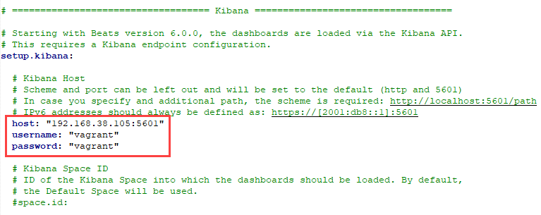

> [!Info]
> Das Passwort sollte man eigentlich nicht in plaintext in die Konfigurationsdatei schreiben, sondern in einem Vault speichern. Wie das funktionieren würde, wird [hier](https://www.elastic.co/guide/en/beats/winlogbeat/master/keystore.html) erklärt.

2. Beim Abschnitt *output.elasticsearch* musste ebenfalls der Host, der Username und das Passwort angepasst werden. Ausserdem musste ich die Zeile ```allow_older_versions: true``` hinzufügen. Dies ermöglicht, dass Winlogbeat (v8.5.3) mit einer älteren Elasticsearch Version (in unserem Fall v7.17.7) verbunden werden kann. Diese Option ist standardmässig deaktiviert und würde daher beim Start von Winlogbeat dazu führen, dass keine Verbindung zu Elasticsearch aufgebaut werden kann. 

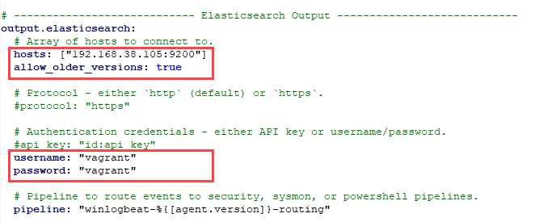

3. Folgende Konfiguration ist optional, ich habe sie aber trotzdem hinzugefügt. Hierbei wird das Schreiben von Logs in Dateien aktiviert, der Pfad der Logdateien wird definiert und auch der Loglevel wird gesetzt.

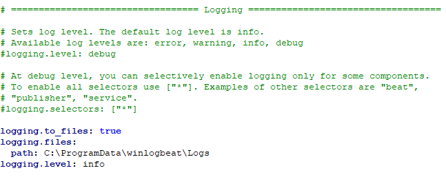

4. Als nächstes können die Logs definiert werden. Diese Logs werden unter *winlogbeat.event_logs* mit ihrem Namen angegeben. Standardmässig werden von Winlogbeat die Logs für Application, Security und System überwacht. In unserem Fall sieht die Konfiguration so aus:

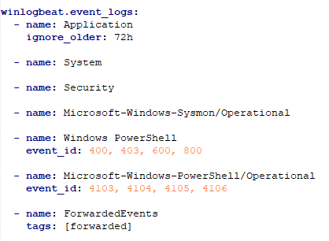

Mit folgendem PowerShell-Befehl können ausserdem alle verfügbaren Logs abgefragt werden:

```PowerShell
Get-EventLog *
```

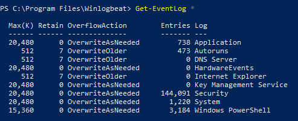

5. Den Rest der Konfiguration habe ich beim Standard belassen. Nachdem ich die Konfiguration gespeichert habe, konnte ich sie mit folgendem Befehl überprüfen:

```PowerShell
.\winlogbeat.exe test config -c .\winlogbeat.yml -e
```

Wenn alles in Ordnung ist, wird es mit einem "Config OK" bestätigt:

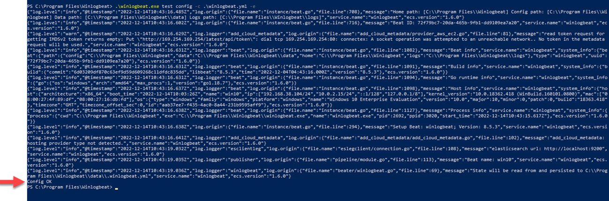

### Winlogbeat-Dienst

1. Winlogbeat bietet vordefinierten Assets zum Parsen, Indizieren und Visualisieren der Daten. Um diese Assets zu laden, muss folgender Befehl ausgeführt werden:

```PowerShell
.\winlogbeat.exe setup -e
```

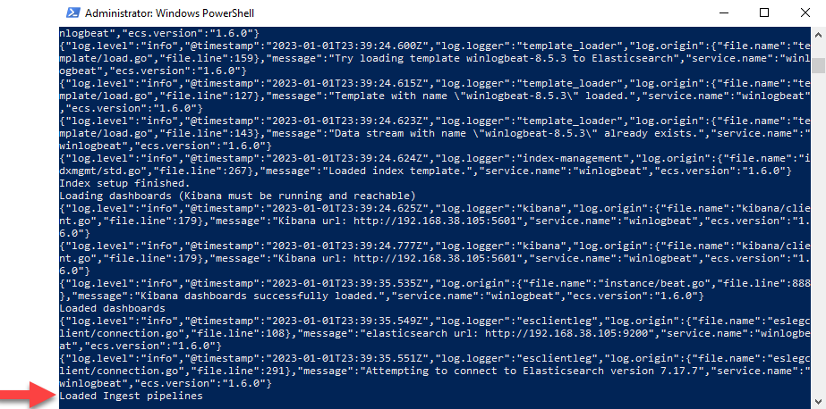

2. Nun kann der Winlogbeat-Dienst mit diesem Befehl gestartet werden:

```PowerShell
Start-Service winlogbeat
```

> [!Tip]
> Mit folgendem Befehl, kann der Dienst wieder gestoppt werden:
> ```Stop-Service winlogbeat```

3. Wenn alles geklappt hat, wird nun unter Diensten (services.msc) *winlogbeat* als *Running* angezeigt:

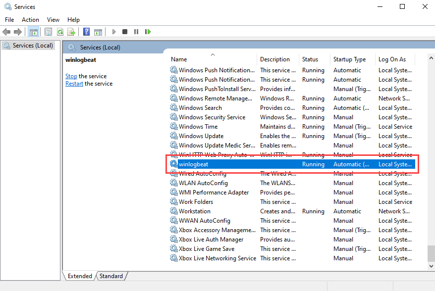

## Dokumentation / Testing

### Logdatei

Fürs Testing habe ich zuerst überprüft, ob überhaupt Logs generiert werden. Dies konnte ich im Verzeichnis *C:\ProgramData\winlogbeat\logs* (welches in winlogbeat.yml definiert wurde) einsehen. In meinem Fall wurden folgende Logs angezeigt:

> [!Tip]
> Diese Logs können auch zum Troubleshooting verwendet werden. Beispielsweise wird hier auch angezeigt, falls keine Verbindung zu Elasticsearch oder Kibana aufgebaut werden kann.

```json
{"log.level":"info","@timestamp":"2023-01-02T01:43:56.664Z","log.origin":{"file.name":"instance/beat.go","file.line":708},"message":"Home path: [C:\\Program Files\\Winlogbeat] Config path: [C:\\Program Files\\Winlogbeat] Data path: [C:\\ProgramData\\winlogbeat] Logs path: [C:\\ProgramData\\winlogbeat\\logs]","service.name":"winlogbeat","ecs.version":"1.6.0"}
{"log.level":"info","@timestamp":"2023-01-02T01:43:56.681Z","log.origin":{"file.name":"instance/beat.go","file.line":716},"message":"Beat ID: 6652900d-0377-43cc-bb12-b08664f0b477","service.name":"winlogbeat","ecs.version":"1.6.0"}
{"log.level":"warn","@timestamp":"2023-01-02T01:43:56.696Z","log.logger":"add_cloud_metadata","log.origin":{"file.name":"add_cloud_metadata/provider_aws_ec2.go","file.line":81},"message":"read token request for getting IMDSv2 token returns empty: Put \"http://169.254.169.254/latest/api/token\": dial tcp 169.254.169.254:80: connectex: A socket operation was attempted to an unreachable network.. No token in the metadata request will be used.","service.name":"winlogbeat","ecs.version":"1.6.0"}
{"log.level":"info","@timestamp":"2023-01-02T01:43:56.698Z","log.logger":"beat","log.origin":{"file.name":"instance/beat.go","file.line":1082},"message":"Beat info","service.name":"winlogbeat","system_info":{"beat":{"path":{"config":"C:\\Program Files\\Winlogbeat","data":"C:\\ProgramData\\winlogbeat","home":"C:\\Program Files\\Winlogbeat","logs":"C:\\ProgramData\\winlogbeat\\logs"},"type":"winlogbeat","uuid":"6652900d-0377-43cc-bb12-b08664f0b477"},"ecs.version":"1.6.0"}}
{"log.level":"info","@timestamp":"2023-01-02T01:43:56.698Z","log.logger":"beat","log.origin":{"file.name":"instance/beat.go","file.line":1091},"message":"Build info","service.name":"winlogbeat","system_info":{"build":{"commit":"6d03209df870c63ef9d59d609268c11dfdc835dd","libbeat":"8.5.3","time":"2022-12-04T04:43:16.000Z","version":"8.5.3"},"ecs.version":"1.6.0"}}
{"log.level":"info","@timestamp":"2023-01-02T01:43:56.698Z","log.logger":"beat","log.origin":{"file.name":"instance/beat.go","file.line":1094},"message":"Go runtime info","service.name":"winlogbeat","system_info":{"go":{"os":"windows","arch":"amd64","max_procs":1,"version":"go1.18.7"},"ecs.version":"1.6.0"}}
{"log.level":"info","@timestamp":"2023-01-02T01:43:56.712Z","log.logger":"add_cloud_metadata","log.origin":{"file.name":"add_cloud_metadata/add_cloud_metadata.go","file.line":102},"message":"add_cloud_metadata: hosting provider type not detected.","service.name":"winlogbeat","ecs.version":"1.6.0"}
{"log.level":"info","@timestamp":"2023-01-02T01:43:56.730Z","log.logger":"beat","log.origin":{"file.name":"instance/beat.go","file.line":1098},"message":"Host info","service.name":"winlogbeat","system_info":{"host":{"architecture":"x86_64","boot_time":"2023-01-02T01:39:37Z","name":"win10","ip":["192.168.38.104/24","10.0.2.15/24","::1/128","127.0.0.1/8"],"kernel_version":"10.0.18362.418 (WinBuild.160101.0800)","mac":["08:00:27:4f:89:df","08:00:27:16:db:fd"],"os":{"type":"windows","family":"windows","platform":"windows","name":"Windows 10 Enterprise Evaluation","version":"10.0","major":10,"minor":0,"patch":0,"build":"18363.418"},"timezone":"GMT","timezone_offset_sec":0,"id":"aab37ee7-f435-4ac0-8a44-231b9595aff9"},"ecs.version":"1.6.0"}}
{"log.level":"info","@timestamp":"2023-01-02T01:43:56.731Z","log.logger":"beat","log.origin":{"file.name":"instance/beat.go","file.line":1127},"message":"Process info","service.name":"winlogbeat","system_info":{"process":{"cwd":"C:\\Windows\\system32","exe":"C:\\Program Files\\Winlogbeat\\winlogbeat.exe","name":"winlogbeat.exe","pid":2476,"ppid":568,"start_time":"2023-01-02T01:43:56.556Z"},"ecs.version":"1.6.0"}}
{"log.level":"info","@timestamp":"2023-01-02T01:43:56.731Z","log.origin":{"file.name":"instance/beat.go","file.line":294},"message":"Setup Beat: winlogbeat; Version: 8.5.3","service.name":"winlogbeat","ecs.version":"1.6.0"}
{"log.level":"info","@timestamp":"2023-01-02T01:43:59.034Z","log.logger":"esclientleg","log.origin":{"file.name":"eslegclient/connection.go","file.line":108},"message":"elasticsearch url: http://192.168.38.105:9200","service.name":"winlogbeat","ecs.version":"1.6.0"}
{"log.level":"info","@timestamp":"2023-01-02T01:43:59.034Z","log.logger":"publisher","log.origin":{"file.name":"pipeline/module.go","file.line":113},"message":"Beat name: win10","service.name":"winlogbeat","ecs.version":"1.6.0"}
{"log.level":"info","@timestamp":"2023-01-02T01:43:59.034Z","log.logger":"winlogbeat","log.origin":{"file.name":"beater/winlogbeat.go","file.line":69},"message":"State will be read from and persisted to C:\\ProgramData\\winlogbeat\\.winlogbeat.yml","service.name":"winlogbeat","ecs.version":"1.6.0"}
{"log.level":"info","@timestamp":"2023-01-02T01:43:59.034Z","log.origin":{"file.name":"instance/beat.go","file.line":471},"message":"winlogbeat start running.","service.name":"winlogbeat","ecs.version":"1.6.0"}
{"log.level":"info","@timestamp":"2023-01-02T01:43:59.048Z","log.logger":"monitoring","log.origin":{"file.name":"log/log.go","file.line":144},"message":"Starting metrics logging every 30s","service.name":"winlogbeat","ecs.version":"1.6.0"}
{"log.level":"info","@timestamp":"2023-01-02T01:44:00.166Z","log.logger":"publisher_pipeline_output","log.origin":{"file.name":"pipeline/client_worker.go","file.line":139},"message":"Connecting to backoff(elasticsearch(http://192.168.38.105:9200))","service.name":"winlogbeat","ecs.version":"1.6.0"}
{"log.level":"info","@timestamp":"2023-01-02T01:44:00.209Z","log.logger":"esclientleg","log.origin":{"file.name":"eslegclient/connection.go","file.line":291},"message":"Attempting to connect to Elasticsearch version 7.17.7","service.name":"winlogbeat","ecs.version":"1.6.0"}
{"log.level":"info","@timestamp":"2023-01-02T01:44:00.270Z","log.logger":"esclientleg","log.origin":{"file.name":"eslegclient/connection.go","file.line":291},"message":"Attempting to connect to Elasticsearch version 7.17.7","service.name":"winlogbeat","ecs.version":"1.6.0"}
{"log.level":"info","@timestamp":"2023-01-02T01:44:00.270Z","log.logger":"index-management","log.origin":{"file.name":"idxmgmt/std.go","file.line":231},"message":"Auto ILM enable success.","service.name":"winlogbeat","ecs.version":"1.6.0"}
{"log.level":"info","@timestamp":"2023-01-02T01:44:00.281Z","log.logger":"index-management.ilm","log.origin":{"file.name":"ilm/std.go","file.line":118},"message":"ILM policy winlogbeat exists already.","service.name":"winlogbeat","ecs.version":"1.6.0"}
{"log.level":"info","@timestamp":"2023-01-02T01:44:00.282Z","log.logger":"index-management","log.origin":{"file.name":"idxmgmt/std.go","file.line":366},"message":"Set settings.index.lifecycle.name in template to {winlogbeat {\"policy\":{\"phases\":{\"hot\":{\"actions\":{\"rollover\":{\"max_age\":\"30d\",\"max_primary_shard_size\":\"50gb\"}}}}}}} as ILM is enabled.","service.name":"winlogbeat","ecs.version":"1.6.0"}
{"log.level":"info","@timestamp":"2023-01-02T01:44:00.292Z","log.logger":"template_loader","log.origin":{"file.name":"template/load.go","file.line":115},"message":"Template \"winlogbeat-8.5.3\" already exists and will not be overwritten.","service.name":"winlogbeat","ecs.version":"1.6.0"}
{"log.level":"info","@timestamp":"2023-01-02T01:44:00.292Z","log.logger":"index-management","log.origin":{"file.name":"idxmgmt/std.go","file.line":267},"message":"Loaded index template.","service.name":"winlogbeat","ecs.version":"1.6.0"}
{"log.level":"info","@timestamp":"2023-01-02T01:44:00.380Z","log.logger":"publisher_pipeline_output","log.origin":{"file.name":"pipeline/client_worker.go","file.line":147},"message":"Connection to backoff(elasticsearch(http://192.168.38.105:9200)) established","service.name":"winlogbeat","ecs.version":"1.6.0"}
{"log.level":"info","@timestamp":"2023-01-02T01:44:22.839Z","log.logger":"monitoring","log.origin":{"file.name":"log/log.go","file.line":186},"message":"Non-zero metrics in the last 30s","service.name":"winlogbeat","monitoring":{"metrics":{"beat":{"cpu":{"system":{"ticks":6812,"time":{"ms":6812}},"total":{"ticks":14765,"time":{"ms":14765},"value":14765},"user":{"ticks":7953,"time":{"ms":7953}}},"info":{"ephemeral_id":"9933a5c0-3687-44ce-bd95-6cc6fb0ad177","name":"winlogbeat","uptime":{"ms":32509},"version":"8.5.3"},"memstats":{"gc_next":133562136,"memory_alloc":84474592,"memory_sys":125648360,"memory_total":606796912,"rss":152297472},"runtime":{"goroutines":38}},"libbeat":{"config":{"module":{"running":0}},"output":{"events":{"acked":8559,"active":50,"batches":153,"total":8609},"read":{"bytes":156340},"type":"elasticsearch","write":{"bytes":26532562}},"pipeline":{"clients":7,"events":{"active":3958,"published":12517,"retry":1015,"total":12517},"queue":{"acked":8559,"max_events":4096}}},"system":{"cpu":{"cores":1},"handles":{"open":279}}},"ecs.version":"1.6.0"}}
{"log.level":"info","@timestamp":"2023-01-02T01:44:48.706Z","log.logger":"monitoring","log.origin":{"file.name":"log/log.go","file.line":186},"message":"Non-zero metrics in the last 30s","service.name":"winlogbeat","monitoring":{"metrics":{"beat":{"cpu":{"system":{"ticks":13109,"time":{"ms":6297}},"total":{"ticks":27515,"time":{"ms":12750},"value":27515},"user":{"ticks":14406,"time":{"ms":6453}}},"info":{"ephemeral_id":"9933a5c0-3687-44ce-bd95-6cc6fb0ad177","uptime":{"ms":62508},"version":"8.5.3"},"memstats":{"gc_next":116484872,"memory_alloc":88102768,"memory_sys":12989040,"memory_total":1039260048,"rss":160321536},"runtime":{"goroutines":38}},"libbeat":{"config":{"module":{"running":0}},"output":{"events":{"acked":9542,"active":50,"batches":191,"total":9542},"read":{"bytes":133631},"write":{"bytes":30121384}},"pipeline":{"clients":7,"events":{"active":4097,"published":9680,"total":9681},"queue":{"acked":9542}}},"system":{"handles":{"open":-5}}},"ecs.version":"1.6.0"}}
{"log.level":"info","@timestamp":"2023-01-02T01:45:23.130Z","log.logger":"monitoring","log.origin":{"file.name":"log/log.go","file.line":186},"message":"Non-zero metrics in the last 30s","service.name":"winlogbeat","monitoring":{"metrics":{"beat":{"cpu":{"system":{"ticks":20078,"time":{"ms":6969}},"total":{"ticks":42453,"time":{"ms":14938},"value":42453},"user":{"ticks":22375,"time":{"ms":7969}}},"info":{"ephemeral_id":"9933a5c0-3687-44ce-bd95-6cc6fb0ad177","uptime":{"ms":92512},"version":"8.5.3"},"memstats":{"gc_next":123020984,"memory_alloc":75643760,"memory_sys":8987040,"memory_total":1602418648,"rss":163762176},"runtime":{"goroutines":38}},"libbeat":{"config":{"module":{"running":0}},"output":{"events":{"acked":12188,"active":50,"batches":244,"total":12188},"read":{"bytes":170903},"write":{"bytes":38593135}},"pipeline":{"clients":7,"events":{"active":4029,"published":12120,"total":12120},"queue":{"acked":12188}}}},"ecs.version":"1.6.0"}}
{"log.level":"info","@timestamp":"2023-01-02T01:46:00.693Z","log.logger":"monitoring","log.origin":{"file.name":"log/log.go","file.line":186},"message":"Non-zero metrics in the last 30s","service.name":"winlogbeat","monitoring":{"metrics":{"beat":{"cpu":{"system":{"ticks":27218,"time":{"ms":7140}},"total":{"ticks":57608,"time":{"ms":15155},"value":57608},"user":{"ticks":30390,"time":{"ms":8015}}},"info":{"ephemeral_id":"9933a5c0-3687-44ce-bd95-6cc6fb0ad177","uptime":{"ms":122520},"version":"8.5.3"},"memstats":{"gc_next":135164904,"memory_alloc":122301160,"memory_sys":65536,"memory_total":2238014104,"rss":167120896},"runtime":{"goroutines":38}},"libbeat":{"config":{"module":{"running":0}},"output":{"events":{"acked":13786,"active":50,"batches":276,"total":13786},"read":{"bytes":192886},"write":{"bytes":44680422}},"pipeline":{"clients":7,"events":{"active":4098,"published":13854,"total":13855},"queue":{"acked":13786}}}},"ecs.version":"1.6.0"}}
{"log.level":"info","@timestamp":"2023-01-02T01:46:28.093Z","log.logger":"monitoring","log.origin":{"file.name":"log/log.go","file.line":186},"message":"Non-zero metrics in the last 30s","service.name":"winlogbeat","monitoring":{"metrics":{"beat":{"cpu":{"system":{"ticks":34656,"time":{"ms":7438}},"total":{"ticks":74077,"time":{"ms":16469},"value":74077},"user":{"ticks":39421,"time":{"ms":9031}}},"info":{"ephemeral_id":"9933a5c0-3687-44ce-bd95-6cc6fb0ad177","uptime":{"ms":152519},"version":"8.5.3"},"memstats":{"gc_next":102658184,"memory_alloc":96781224,"memory_sys":4329680,"memory_total":2897389304,"rss":163004416},"runtime":{"goroutines":38}},"libbeat":{"config":{"module":{"running":0}},"output":{"events":{"acked":14486,"active":50,"batches":290,"total":14486},"read":{"bytes":202661},"write":{"bytes":46019095}},"pipeline":{"clients":7,"events":{"active":4056,"published":14446,"total":14444},"queue":{"acked":14486}}}},"ecs.version":"1.6.0"}}
{"log.level":"info","@timestamp":"2023-01-02T01:46:49.380Z","log.logger":"monitoring","log.origin":{"file.name":"log/log.go","file.line":186},"message":"Non-zero metrics in the last 30s","service.name":"winlogbeat","monitoring":{"metrics":{"beat":{"cpu":{"system":{"ticks":41531,"time":{"ms":6875}},"total":{"ticks":90749,"time":{"ms":16672},"value":90749},"user":{"ticks":49218,"time":{"ms":9797}}},"info":{"ephemeral_id":"9933a5c0-3687-44ce-bd95-6cc6fb0ad177","uptime":{"ms":182520},"version":"8.5.3"},"memstats":{"gc_next":130904232,"memory_alloc":115997872,"memory_total":3649476128,"rss":162590720},"runtime":{"goroutines":38}},"libbeat":{"config":{"module":{"running":0}},"output":{"events":{"acked":16034,"active":50,"batches":321,"total":16034},"read":{"bytes":224618},"write":{"bytes":53168396}},"pipeline":{"clients":7,"events":{"active":4097,"published":16074,"total":16075},"queue":{"acked":16034}}},"system":{"handles":{"open":2}}},"ecs.version":"1.6.0"}}
{"log.level":"info","@timestamp":"2023-01-02T01:47:15.862Z","log.logger":"monitoring","log.origin":{"file.name":"log/log.go","file.line":186},"message":"Non-zero metrics in the last 30s","service.name":"winlogbeat","monitoring":{"metrics":{"beat":{"cpu":{"system":{"ticks":48796,"time":{"ms":7265}},"total":{"ticks":107280,"time":{"ms":16531},"value":107280},"user":{"ticks":58484,"time":{"ms":9266}}},"info":{"ephemeral_id":"9933a5c0-3687-44ce-bd95-6cc6fb0ad177","uptime":{"ms":212509},"version":"8.5.3"},"memstats":{"gc_next":131175656,"memory_alloc":119485816,"memory_total":4310307616,"rss":169017344},"runtime":{"goroutines":38}},"libbeat":{"config":{"module":{"running":0}},"output":{"events":{"acked":14236,"active":50,"batches":285,"total":14236},"read":{"bytes":198723},"write":{"bytes":46997191}},"pipeline":{"clients":7,"events":{"active":4097,"published":14236,"total":14236},"queue":{"acked":14236}}}},"ecs.version":"1.6.0"}}
{"log.level":"info","@timestamp":"2023-01-02T01:47:51.114Z","log.logger":"monitoring","log.origin":{"file.name":"log/log.go","file.line":186},"message":"Non-zero metrics in the last 30s","service.name":"winlogbeat","monitoring":{"metrics":{"beat":{"cpu":{"system":{"ticks":55343,"time":{"ms":6547}},"total":{"ticks":123468,"time":{"ms":16188},"value":123468},"user":{"ticks":68125,"time":{"ms":9641}}},"info":{"ephemeral_id":"9933a5c0-3687-44ce-bd95-6cc6fb0ad177","uptime":{"ms":242509},"version":"8.5.3"},"memstats":{"gc_next":127848504,"memory_alloc":91378560,"memory_total":4942866272,"rss":160428032},"runtime":{"goroutines":38}},"libbeat":{"config":{"module":{"running":0}},"output":{"events":{"acked":13588,"active":50,"batches":272,"total":13588},"read":{"bytes":188230},"write":{"bytes":44325623}},"pipeline":{"clients":7,"events":{"active":4061,"published":13553,"total":13552},"queue":{"acked":13588}}}},"ecs.version":"1.6.0"}}
```

### Winlogbeat mit Kibana

1. Für diesen Test öffnete ich Kibana unter: [http://192.168.38.105:5601](http://192.168.38.105:5601) (Benutzername: vagrant / Passwort: vagrant). Dort wählte ich auf der Navigation links *Analytics* und dann *Discover*. Dort wählte ich auf der linken Seite winlogbeat-* aus dem Dropdown-Feld aus, damit die Logs von Winlogbeat angezeigt werden. Oben rechts habe ich dann noch den gewünschten Zeitraum der Logs ausgewählt.

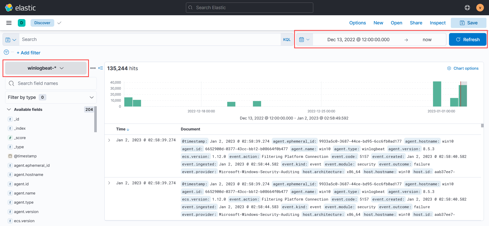

2. Es werden nun ganz viele Daten / Events angezeigt. Wählt man auf der linken Seite ein Datenfeld aus, kann über den *Visualize* Button ein Diagramm erstellt werden.

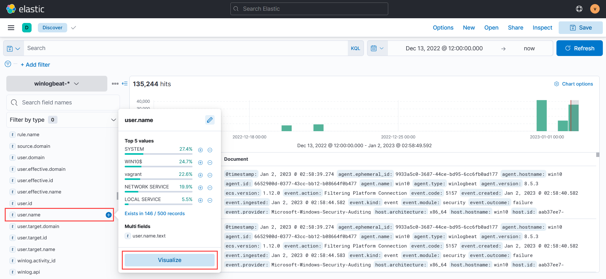

3. Oberhalb des Diagramms kann der Diagramm-Typ ausgewählt werden. Auf der rechten Seite können dann noch die verschiedenen Achsen definiert werden. Hierzu kann man einfach Datenfelder von der linken Seite auf das entsprechende Achsen-Feld ziehen, um es anzuwenden.  
Da ich Winlogbeat auf nur einem Client installiert hatte, konnte ich mein Diagramm nur im Bezug zu einem Gerät erstellen. Mein Beispiel-Diagramm zeigt, wieviele Events von welchem Benutzer ausgelöst wurde.

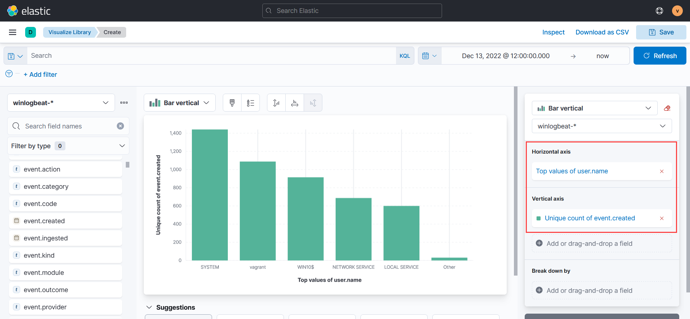

4. Es gibt aber auch viele vorgefertigte Dashboards, welche auch angepasst werden können. Um diese Dashboards zu nutzen, kann man in der Navigation links *Analytics* und dann *Dashbard* wählen.

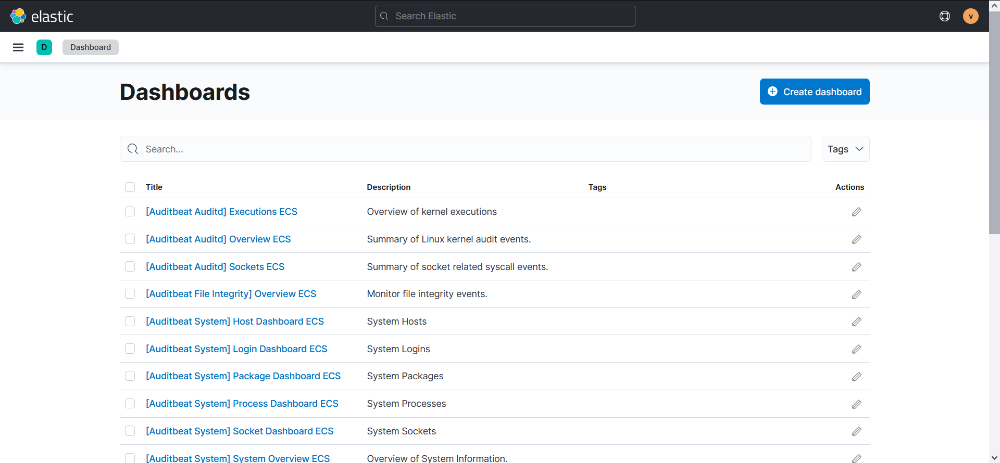
