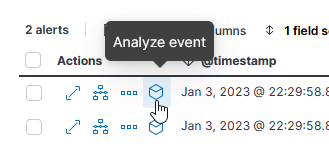

# Security Dashboards ELK

## Recherche

### Vordefinierte Regeln

Security Rules sind Regeln, anhand welcher die Logs nach bestimmten Events oder Anomalien überprüft werden. In ELK können die Security Rules unter folgendem Link eingesehen werden:  
[http://192.168.38.105:5601/app/security/rules](http://192.168.38.105:5601/app/security/rules)

Auf dieser Seite gibt es eine grosse Liste an vordefinierten Regeln. Man kann eine Regel auswählen, um diese zu nutzen, zu kopieren oder anzupassen. Oben rechts können aber auch von Grund auf neue Regeln erstellt werden.  
Für die Erklärung des Aufbaus der Regeln, wählen wir eine vordefinierte Regel aus:


Oben ist der Titel der Regel und die letzte Aktualisierungszeit zu sehen:


Als nächstes gibt es die Abschnitte *About*, *Definition* und *Schedule*.  
* Das *About* enthält allgemeine Informationen zur Regel. Dies beinhaltet eine kurze Beschreibung der Regel, der Schweregrad der geprüften Events, Verweisungen auf andere Quellen, die Lizenz und auch der Bezug zu [MITRE ATT&CK](https://attack.mitre.org/).
* Bei der *Definition* wird angegeben, welche Logs geprüft werden (z.B. von Winlogbeat, Filebeat, etc.) und auch die Query, welche zur Prüfung verwendet wird.
* Das *Schedule* beschreibt, in welcher Frequenz die Regel durchgeführt wird.


Ganz unten gibt es noch einen Abschnitt, bei dem ausgelöste Alarme angezeigt werden. Da diese Regel nicht ausgelöst wurde, werden im Screenshot keine Werte angezeigt. Die Alarme könnten hier auch als "bestätigt" oder "geschlossen" markiert werden.


### Regeln anpassen

Möchte man eine vordefinierte Regel anpassen, muss eine Kopie erstellt werden. Dies kann oben rechts über die drei Punkte gemacht werden:


Im Abschnitt *Definition* können dann die Log-Typen ausgewählt und die Query angepasst werden.


Im Abschnitt *About* kann die Beschreibung und der Schweregrad definiert werden.


Im Abschnitt *Schedule* kann der Intervall festgelegt werden, in der die Regel ausgeführt werden soll.


Im Abschnitt *Action* kann schliesslich festgelegt werden, welche Aktion beim auslösen der Regel durchgeführt werden soll. Hier gibt es viele *Connectors*, welche genutz werden können, um Alarm-Benachrichtigungen zu versenden. Es kann auch eingestellt werden, wie häufig die Benachrichtigung versendet werden soll. Beispielsweise kann ein Alarm bei jeder Auslösung der Regel versendet werden oder auch nur ein Mal in der Stunde.


## Dokumentation / Testing

Für das Testing habe ich mir für die vordefinierte Regel: *Disabling Windows Defender Security Settings via PowerShell* entschieden.


Diese Regel hat einen mittleren Schweregrad und prüft, ob über den PowerShell-Befehl ```Set-MpPreference``` die Konfiguration von Windows Defender verändert wurde.  
Wie im Bereich *Definition* zu sehen ist, können hierfür die Daten von winlogbeat-* verwendet werden. Deshalb habe ich für den Test die win10.windomain.local-VM verwendet. In der Custom Query kann man ausserdem sehen, dass die Regel auf den event.type: "start", den process.name: "powershell.exe" und process.args: "Set-MpPreference" und  "-Disable*" oder "NeverSend" achtet.


Nach langem Testen, bin ich auf folgende zwei cmd-Befehle gekommen, welche genau diese Logs generieren sollten. Zum Testen habe ich sie auf der win10-VM ausgeführt:


Um zu prüfen, dass auch die richtigen Werte beim event.type, process.name und process.args geloggt wurden, habe ich während dem Testen unter [http://192.168.38.105:5601/app/discover](http://192.168.38.105:5601/app/discover) die Logs übersichtlicher darstellen lassen. Das habe ich gemacht, indem ich die entsprechenden Felder auf der linken Seite selektiert habe, damit sie auf der rechten Seite als Spalte erscheinen. So konnte ich einfacher sehen, welche Werte bei den Logs nach jeder getesteten Aktion gesetzt wurden.  
Hier im Screenshot sind beide Logs zu sehen, welche durch die beiden oben ausgeführten Befehle generiert wurden:


Nach dem Test konnte man in der Regel auch sehen, dass für jeden der beiden ausgeführten Befehle je ein Alarm generiert wurde.


Um mehr Details zu sehen, kann man links das entsprechende Feld wählen:


Dann wird eine Übersicht des ausgelösten Alarms angezeigt. Hier ist auch schön zu sehen, welche Datenfelder aus dem Log, welche Werte enthielten:


Unter *Table* gibt es noch eine komplette Übersicht aller Datenfelder aus demselben Log:


Das Ganze kann man auch noch im JSON-Format ansehen:


Um mehr über die Events zu erfahren, kann man auf der linken Seite bei den ausgelösten Alarmen "Analyze event" auswählen:



Hier wird in einer grafischen Darstellung gezeigt, welche Prozesse und Events zur Auslösung des Alarms führten. Das Ganze ist interaktiv, indem man die einzelnen Werte anklicken kann. Als ich hier zum Beispiel bei "powershell.exe" auf die "8 registry" klickte, wurden links alle Registry-Keys angezeigt, welche durch den PowerShell-Befehl verändert wurden.


Das war mein Test, bei dem man die Auslösung einer Regel anhand zwei Befehle sieht und einen kleinen Einblick zu den Möglichkeiten der Analyse erhält.
