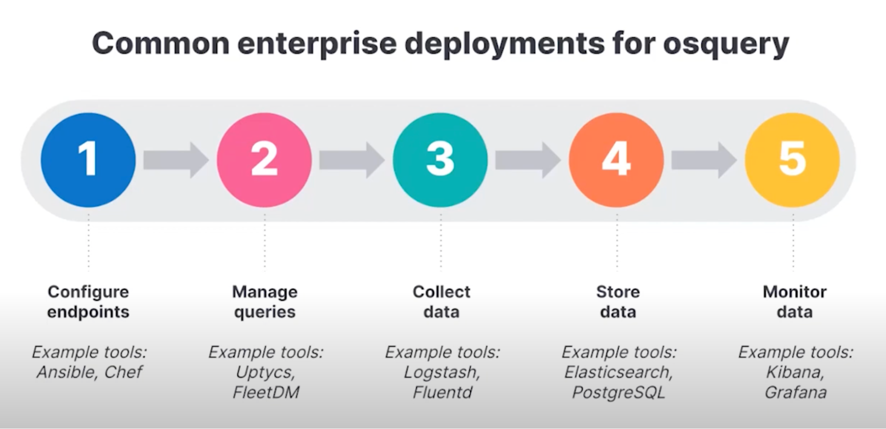
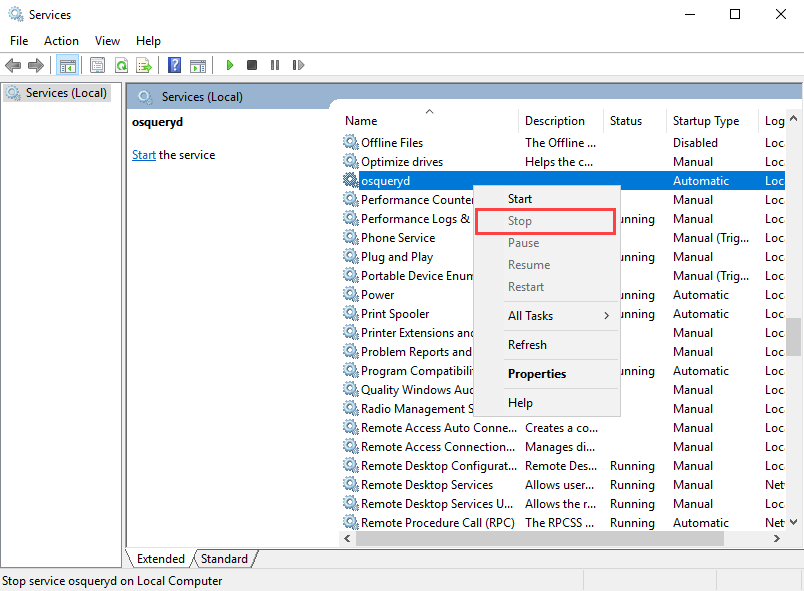
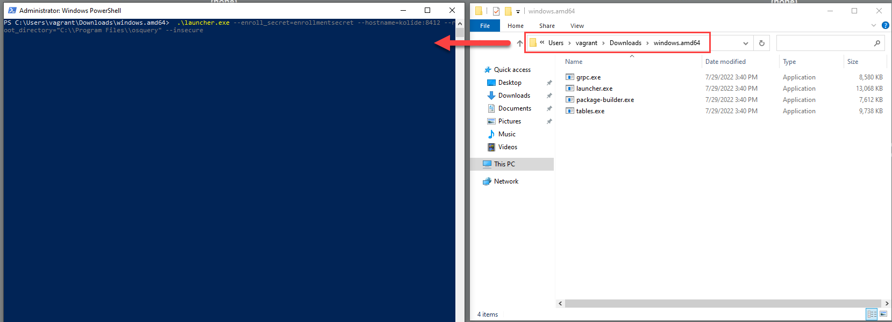
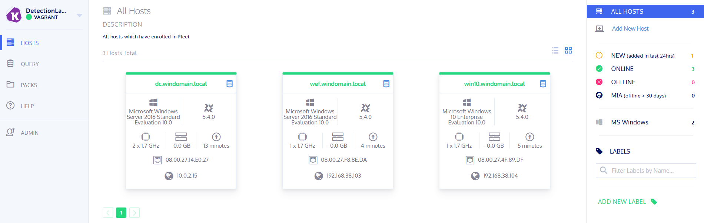

# Beschreibung der Software OSQuery

## Recherche

**Was ist OSQuery? Wofür wird es verwendet?**

OSQuery wurde 2014 von Facebook entwickelt. Es handelt sich dabei um ein performantes Framework zur Überwachung und Instrumentierung von Betriebssystemen für Windows, OS X (macOS) und Linux. OSQuery stellt ein Betriebssystem als hochleistungsfähige relationale Datenbank dar. Dies ermöglicht es, SQL-Abfragen zu schreiben, um Betriebssystemdaten zu untersuchen. OSQuery präsentiert anhand SQL-Tabellen abstrakte Konzepte wie laufende Prozesse, geladene Kernelmodule, offene Netzwerkverbindungen, Browser-Plugins, Hardware-Ereignisse oder Datei-Hashes. Mit Einblick in diese Systemdaten ist OSQuery ein geeignetes Tool bei der Suche nach Cyber-Bedrohungen, digitaler forensischer Analyse oder Intrusion Detection.

**Was ist die aktuellste Version von OSQuery?**

Die aktuellste Version von OSQuery ist [v5.6.0](https://github.com/osquery/osquery/releases/tag/5.6.0). Der Download auf der offiziellen Webseite findet man [hier](https://osquery.io/downloads/official/5.6.0).  
Der Versionsverlauf kann auf [GitHub](https://github.com/osquery/osquery/releases) eingesehen werden.

**Was sind Beispiel-Anwendungen/Use-Cases bei welchen OSQuery helfen kann?**

OSQuery könnte man als Intrusion Detection System in einer Netzwerkinfrastruktur einsetzen. Dafür würde man den OSQuery Dienst auf allen zu überwachenden Hosts installieren und konfigurieren. Damit besteht die Möglichkeit, verschiedene Systemprozesse, Hardware-Ereignisse und viele weitere Systemdaten zu loggen.  
Mit einem OSQuery-Fleet-Manager könnte man dann die ganzen Abfragen verwalten. In unserem LAB-Beispiel nutzen wir hierfür *Kolide Fleet*.
Diese Logs können dann von einem anderen Dienst gesammelt und überwacht werden. Bei unserem Beispiel haben wir dazu den ELK-Stack verwenden. Dieser nutzt Logstash für das Sammeln der Log-Daten, Elasticsearch für das Speichern der Daten und Kibana für das grafische Monitoring.

Es gibt aber auch andere Tools, mit denen man die Daten auswerten und darstellen kann. Ein Beispiel dazu wäre [Grafana](https://grafana.com/).



## Installation / Konfiguration / Testing

### Installation

Die Installation von OSQuery wurde auf den Windows Servern/Clients des LABs automatisiert durchgeführt. Dazu wurde bei der Erstellung der VM mit Vagrant das Skript *install-osquery.ps1* durchgeführt. Mit diesem Skript wird die [OSQuery-Konfiguration von Palantir](https://github.com/palantir/osquery-configuration) übernommen. Dieses Skript führt folgende Aufgaben aus:

1. Hier wird OSQuery installiert:

```PowerShell
# Purpose: Installs osquery on the host
# Note: by default, osquery will be configured to connect to the Fleet server on the "logger" host via TLS.

Write-Host "$('[{0:HH:mm}]' -f (Get-Date)) Installing osquery..."
$flagfile = "c:\Program Files\osquery\osquery.flags"
choco install -y --limit-output --no-progress osquery | Out-String  # Apparently Out-String makes the process wait
```

2. Dann wird ein OSQuery-Dienst erstellt, der mit einem Flagfile gestartet werden soll:

```PowerShell
$service = Get-WmiObject -Class Win32_Service -Filter "Name='osqueryd'"
If (-not ($service)) {
  Write-Host "Setting osquery to run as a service"
  New-Service -Name "osqueryd" -BinaryPathName "C:\Program Files\osquery\osqueryd\osqueryd.exe --flagfile=`"C:\Program Files\osquery\osquery.flags`""
```

3. Als nächstes wird ein Flagfile von Palantir über GitHub heruntergeladen:

```PowerShell
  # Download the flags file from the Palantir osquery-configuration Github
  # GitHub requires TLS 1.2 as of 2/1/2018
  [Net.ServicePointManager]::SecurityProtocol = [Net.SecurityProtocolType]::Tls12
  Invoke-WebRequest -Uri "https://raw.githubusercontent.com/palantir/osquery-configuration/master/Classic/Endpoints/Windows/osquery.flags" -OutFile $flagfile
```

> [!Tip]
> Die Bedeutung der einzelnen Flags kann [hier](https://osquery.readthedocs.io/en/stable/installation/cli-flags/) nachgelesen werden.

4. Es werden dann noch einige Änderungen an der Konfigurationsdatei gemacht und einige Flags entsprechend unserer Infrastruktur angepasst. Hier wird unter anderem auch die Serveradresse und der Port des Kolide-Fleet-Diensts angegeben:

```PowerShell
  ## Use the TLS config
  ## Add entry to hosts file for Kolide for SSL validation
  Add-Content "c:\windows\system32\drivers\etc\hosts" "        192.168.38.105    kolide"
  ## Add kolide secret and avoid BOM
  $Utf8NoBomEncoding = New-Object System.Text.UTF8Encoding $False
  [System.IO.File]::WriteAllLines("c:\Program Files\osquery\kolide_secret.txt", "enrollmentsecret", $Utf8NoBomEncoding)
  ## Change TLS server hostname in the flags file
  (Get-Content $flagfile) -replace 'tls.endpoint.server.com', 'kolide:8412' | Set-Content $flagfile
  ## Change path to secrets in the flags file
  (Get-Content $flagfile) -replace 'path\\to\\file\\containing\\secret.txt', 'Program Files\osquery\kolide_secret.txt' | Set-Content $flagfile
  ## Change path to certfile in the flags file
  (Get-Content $flagfile) -replace 'c:\\ProgramData\\osquery\\certfile.crt', 'c:\Program Files\osquery\certfile.crt' | Set-Content $flagfile
  ## Remove the verbose flag and replace it with the logger_min_status=1 option (See https://github.com/osquery/osquery/issues/5212)
  (Get-Content $flagfile) -replace '--verbose=true', '--logger_min_status=1' | Set-Content $flagfile
  ## Add certfile.crt
  Copy-Item "c:\vagrant\resources\fleet\server.crt" "c:\Program Files\osquery\certfile.crt"
  ## Start the service
  Start-Service osqueryd
}
```

5. Hier gäbe es noch einen Output, falls OSQuery bereits installiert oder gestartet wurde:

```PowerShell
else {
  Write-Host "osquery is already installed. Moving On."
}
If ((Get-Service -name osqueryd).Status -ne "Running")
{
  throw "osqueryd service was not running"
}
```

### Beschreibung und Struktur der Konfigurations-Datei

Die OSQuery-Konfiguration ist in folgender Datei gespeichert: *C:\Program Files\osquery\osquery.conf*

Die Config-Datei ist im JSON-Format geschrieben. Es gibt viele verschiedene Komponente, welche in der Config-Datei festgelegt werden können. Im Folgenden werden die Komponente grob erklärt, welche wir bei unserer Konfiguration verwendet haben.

* Hier werden die Daemon-Optionen und Feature-Einstellungen gesetzt:

```json
// Configure the daemon below:
"options": {

  // The log directory stores info, warning, and errors.
  // If the daemon uses the 'filesystem' logging retriever then the log_dir
  // will also contain the query results.
  //"logger_path": "/var/log/osquery",

  // Set 'disable_logging' to true to prevent writing any info, warning, error
  // logs. If a logging plugin is selected it will still write query results.
  //"disable_logging": "false",

  // Splay the scheduled interval for queries.
  // This is very helpful to prevent system performance impact when scheduling
  // large numbers of queries that run a smaller or similar intervals.
  //"schedule_splay_percent": "10",
},
```

* Hier können Queries geplant werden. Das beinhaltet SQL-Abfragen und -Intervalle.

```json
// Define a schedule of queries:
"schedule": {
  // This is a simple example query that outputs basic system information.
  "system_info": {
    // The exact query to run.
    "query": "SELECT hostname, cpu_brand, physical_memory FROM system_info;",
    // The interval in seconds to run this query, not an exact interval.
    "interval": 3600
  }
},

// Decorators are normal queries that append data to every query.
"decorators": {
  "load": [
    "SELECT uuid AS host_uuid FROM system_info;",
    "SELECT user AS username FROM logged_in_users ORDER BY time DESC LIMIT 1;"
  ]
},
```

* Hier können noch andere Query-Packs hinzugefügt werden:

```json
// Add default osquery packs or install your own.
//
// There are several 'default' packs installed via
// packages and/or Homebrew.
//
// Linux:        /opt/osquery/share/osquery/packs
// OS X:         /var/osquery/packs
// Homebrew:     /usr/local/share/osquery/packs
// make install: {PREFIX}/share/osquery/packs
//
"packs": {
  // "osquery-monitoring": "/opt/osquery/share/osquery/packs/osquery-monitoring.conf",
  // "incident-response": "/opt/osquery/share/osquery/packs/incident-response.conf",
  // "it-compliance": "/opt/osquery/share/osquery/packs/it-compliance.conf",
  // "osx-attacks": "/var/osquery/packs/osx-attacks.conf",
  // "vuln-management": "/opt/osquery/share/osquery/packs/vuln-management.conf",
  // "hardware-monitoring": "/opt/osquery/share/osquery/packs/hardware-monitoring.conf",
  // "ossec-rootkit": "/opt/osquery/share/osquery/packs/ossec-rootkit.conf",
  // "windows-hardening": "C:\\Program Files\\osquery\\packs\\windows-hardening.conf",
  // "windows-attacks": "C:\\Program Files\\osquery\\packs\\windows-attacks.conf"
},

// Provides feature vectors for osquery to leverage in simple statistical 
// analysis of results data. 
//
// Currently this configuration is only used by Windows in the Powershell
// Events table, wherein character_frequencies is a list of doubles 
// representing the aggregate occurrence of character values in Powershell 
// Scripts. A default configuration is provided which was adapated from 
// Lee Holmes cobbr project: 
// https://gist.github.com/cobbr/acbe5cc7a186726d4e309070187beee6
// 
"feature_vectors": {
  "character_frequencies": [
    0.0,      0.0,      0.0,      0.0,       0.0,      0.0,      0.0,
    0.0,      0.0,      0.0,      0.0,       0.0,      0.0,      0.0,
    0.0,      0.0,      0.0,      0.0,       0.0,      0.0,      0.0,
    0.0,      0.0,      0.0,      0.0,       0.0,      0.0,      0.0,
    0.0,      0.0,      0.0,      0.0,       0.0,      0.00045,  0.01798,
    0.0,      0.03111,  0.00063,  0.00027,   0.0,      0.01336,  0.0133,
    0.00128,  0.0027,   0.00655,  0.01932,   0.01917,  0.00432,  0.0045,
    0.00316,  0.00245,  0.00133,  0.001029,  0.00114,  0.000869, 0.00067,
    0.000759, 0.00061,  0.00483,  0.0023,    0.00185,  0.01342,  0.00196,
    0.00035,  0.00092,  0.027875, 0.007465,  0.016265, 0.013995, 0.0490895,
    0.00848,  0.00771,  0.00737,  0.025615,  0.001725, 0.002265, 0.017875,
    0.016005, 0.02533,  0.025295, 0.014375,  0.00109,  0.02732,  0.02658,
    0.037355, 0.011575, 0.00451,  0.005865,  0.003255, 0.005965, 0.00077,
    0.00621,  0.00222,  0.0062,   0.0,       0.00538,  0.00122,  0.027875,
    0.007465, 0.016265, 0.013995, 0.0490895, 0.00848,  0.00771,  0.00737,
    0.025615, 0.001725, 0.002265, 0.017875,  0.016005, 0.02533,  0.025295,
    0.014375, 0.00109,  0.02732,  0.02658,   0.037355, 0.011575, 0.00451,
    0.005865, 0.003255, 0.005965, 0.00077,   0.00771,  0.002379, 0.00766,
    0.0,      0.0,      0.0,      0.0,       0.0,      0.0,      0.0,
    0.0,      0.0,      0.0,      0.0,       0.0,      0.0,      0.0,
    0.0,      0.0,      0.0,      0.0,       0.0,      0.0,      0.0,
    0.0,      0.0,      0.0,      0.0,       0.0,      0.0,      0.0,
    0.0,      0.0,      0.0,      0.0,       0.0,      0.0,      0.0,
    0.0,      0.0,      0.0,      0.0,       0.0,      0.0,      0.0,
    0.0,      0.0,      0.0,      0.0,       0.0,      0.0,      0.0,
    0.0,      0.0,      0.0,      0.0,       0.0,      0.0,      0.0,
    0.0,      0.0,      0.0,      0.0,       0.0,      0.0,      0.0,
    0.0,      0.0,      0.0,      0.0,       0.0,      0.0,      0.0,
    0.0,      0.0,      0.0,      0.0,       0.0,      0.0,      0.0,
    0.0,      0.0,      0.0,      0.0,       0.0,      0.0,      0.0,
    0.0,      0.0,      0.0,      0.0,       0.0,      0.0,      0.0,
    0.0,      0.0,      0.0,      0.0,       0.0,      0.0,      0.0,
    0.0,      0.0,      0.0,      0.0,       0.0,      0.0,      0.0,
    0.0,      0.0,      0.0,      0.0,       0.0,      0.0,      0.0,
    0.0,      0.0,      0.0,      0.0,       0.0,      0.0,      0.0,
    0.0,      0.0,      0.0,      0.0,       0.0,      0.0,      0.0,
    0.0,      0.0,      0.0
  ]
}
```

> [!Tip]
> Eine detailierte Beschreibung aller Komponente gibt es [hier](https://osquery.readthedocs.io/en/stable/deployment/configuration/) in der offiziellen Dokumentation von OSQuery zu finden.

### Erster Test mit OSQuery

Um OSQuery zu testen, habe ich die logger-VM für Kolide und die anderen drei Windows VMs für Testszwecke gestartet. Über [https://192.168.38.105:8412](https://192.168.38.105:8412) konnte man dann schliesslich auf Kolide zugreifen. Allerdings werden die Windows VMs nicht direkt von Kolide erkannt. Dafür haben wir einen Hilfslauncher in Betrieb genommen, der das Ganze vereinfacht. Die folgenden Schritte habe ich bei allen Windows VMs durchgeführt, damit dieser über OSQuery mit Kolide kommuniziert:

1. Als erstes habe ich den Dienst *osqueryd* gestoppt:



2. Über [GitHub](https://github.com/kolide/launcher/releases/download/v0.12.1/windows-binaries.zip) habe ich dann die Binaries für den Hilfslauncher heruntergeladen und entpackt.

3. Im Verzeichnis des Launchers habe ich die PowerShell als Administrator geöffnet und den Launcher über folgenden Befehl gestartet:

```PowerShell
.\launcher.exe --enroll_secret=enrollmentsecret --hostname=kolide:8412 --root_directory="C:\\Program Files\\osquery" --insecure
```



4. Nachdem ich den Hilflauncher auf allen Windows-VMs gestartet habe, konnte ich Kolide über die Adresse [https://192.168.38.105:8412](https://192.168.38.105:8412) starten (Benutzer: vagrant / Passwort: vagrant). Wenn alles geklappt hat, sollten die Windows Server/Clients grün aufgelistet werden.



> [!Info]
> Sollten die Windows-VMs neugestartet werden, zeigt Kolide diese wieder als offline (rot) an. Damit sie wieder online (grün) sind, muss der Hilfslauncher nochmals wie oben beschrieben gestartet werden. 
