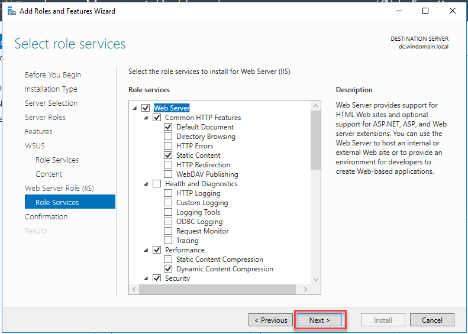

# Installation und Konfiguration von WSUS (und Active Directory)

## Recherche

**Wofür wird der WSUS-Dienst verwendet?**

Der WSUS (Windows Server Update Services) ist dafür zuständig, gewünschte Updates herunterzuladen und für ausgewählte Computer freizuschalten. Dabei können Updates für verschiedene Betriebssysteme gesucht und diese einzeln freigegeben oder gesperrt werden. Die Nutzung eines WSUS lässt sich zudem über GPOs steuern.

**Welche Alternativen gibt es für den WSUS-Dienst?**

Im Folgenden finden Sie eine Übersicht von verschiedenen WSUS-Alternativen:

* [Automox](https://www.automox.com/solutions/automated-cross-os-patching)
* [GFI LanGuard](https://www.gfi.com/products-and-solutions/network-security-solutions/languard/features)
* [Ivanti Security Controls](https://www.ivanti.com/de/products/security-controls)
* [Kaseya VSA](https://www.kaseya.com/de/produkte/vsa/)
* [ManageEngine Patch Manager Plus](https://www.manageengine.com/patch-management/)
* [PDQ Deploy](https://www.pdq.com/solutions/patch-management-software/)
* [Quest KACE System Management Appliance](https://www.quest.com/de-de/products/kace-systems-management-appliance/)
* [SolarWinds Patch Manager](https://www.solarwinds.com/patch-manager)

**Welche Powershell-Cmdlets gibt es, um den WSUS-Dienst zu konfigurieren/steuern?**

Folgende Liste zeigt einige PowerShell-Befehle, mit welchen sich der WSUS-Dienst auf dem Server steuern lässt:

Einen PC einer bestimmten WSUS-Gruppe hinzufügen:
```powershell
Add-WsusComputer
```

Updates freigeben:
```powershell
Approve-WsusUpdate
```

Updates verweigern:
```powershell
Deny-WsusUpdate
```

Alle verfügbaren Klassifikationen anzeigen:
```powershell
Get-WsusClassification
```

WSUS-Computer anzeigen lassen:
```powershell
Get-WsusComputer
```

Liste aller Programme anzeigen, für die der Server Patches bereithält:
```powershell
Get-WsusProduct
```

Alle WSUS-Server im Netzwerk anzeigen:
```powershell
Get-WsusServer
```

Informationen zu Updates anzeigen:
```powershell
Get-WsusUpdate
```

Den Bereinigungsvorgang starten:
```powershell
Invoke-WsusServerCleanup
```

Klassifikationen zu WSUS hinzufügen:
```powershell
Set-WsusClassification
```

Produkte zu WSUS hinzufügen:
```powershell
Set-WsusProduct
```

WSUS-Synchronisierung steuern:
```powershell
Set-WsusServerSynchronization
```

## WSUS-Server

### Server-Installation

1. Im Server Manager eine neue Server Rolle hinzufügen:


2. Rollen- oder Funktionsbasierte Installation auswählen:


3. Windows Server Update Services auswählen:


4. Feature hinzufügen und dann weiter:


5. Sicherstellen, dass *WID Connectivity* und *WSUS Services* ausgewählt ist:


6. Hier wird der Speicherort festgelegt, an dem die Updates gespeichert werden:

> [!Warning]
> Es ist wichtig, dass an diesem Speicherort genügend Speicherplatz vorhanden ist. Sollte der Speicherplatz voll sein, wird der WSUS keine weiteren Updates mehr herunterladen.




7. Alle Angaben nochmals überprüfen. Danach auf installieren klicken:


8. Ist die Installation abgeschlossen, kann das Fenster geschlossen werden:


9. Im Server Manager wird oben ein gelbes Warnsymbol angezeigt. Klickt man auf dieses, kann über *Launch Post-Installation tasks* die restliche Installation abgeschlossen werden:


### Server-Konfiguration

1. Im Server Manager kann oben rechts unter Tools der  Windows Server Update Services Dienst geöffnet werden.

2. Öffnet man diesen das erste Mal, wird automatisch der WSUS Server Configuration Wizard gestartet. Möchte man diesen im Nachhinein nochmals aufrufen, kann dieser über die Options gestartet werden.


3. Die nächsten Schritte können alle weiter geklickt werden.


4. Hier muss mit dem Upstream Server verbunden werden.


5. Hier können die Sprachen gewählt werden, für welche Updates heruntergeladen werden sollen.


6. Bei dieser Liste können alle Produkte ausgewählt werden, für welche Updates heruntergeladen werden sollen.  
Da ich mit den anderen VMs einen Windows 10 Client und einen Windows Server 2016 hatte, habe ich mich für Updates von Windows 10 (Version 1903 und später), Windows Server 2016 und Microsoft Defender Antivirus entschieden.


7. Hier kann noch ausgewählt werden, welche Art von Updates heruntergeladen werden soll.  
Ich habe mich hierbei auf das wichtigste beschränkt und somit nur Critical-, Definitions- und Security-Updates ausgewählt.


8. Die Synchronisation habe ich auf manuell belassen.


9. Mit diesem Haken wird der erste Sync direct nach Abschluss dieser Konfiguration gestartet.


10. Die Synchronisation kann sehr lange dauern. In meinem Fall hat es über 5 Stunden gedauert. Sobald dieser erfolgreich abgeschlossen ist, wird dieser unter Synchronisations grün markiert.


11. Unter *All Updates* können nun die synchronisierten Updates angezeigt werden. Dazu muss man noch den Filter oben anpassen, damit beispielsweise alle Updates ausser solche, die verweigert wurden, angezeigt werden.


12. Nun können die gewünschten Updates ausgewählt werden und über *Approve* auf der rechten Seite genehmigt werden. Hier können dann die Updates für verschiedene Computer-Gruppe einzeln freigegeben werden. In meinem Fall habe ich es für die *Unassigned Computers* Gruppe freigegeben, da dort die anderen VMs drin waren.


13. Nun muss noch ein kurzer Moment gewartet werden, damit die Updates genehmigt werden.


14. Nachdem die Updates freigegeben wurden, werden diese heruntergeladen. Unter *DC* kann der Download Status überprüft werden.


## WSUS-Client

### GPO Konfiguration

1. Um die Clients zu konfigurieren, kann eine GPO verwendet werden. Dazu öffnet man im Server Manager oben rechts unter Tools den Group Policy Manager.

2. Im Group Policy Manager erstellt man an der gewünschten Stelle eine neue GPO. In meinem Fall habe ich diese direkt im obersten Verzeichnis erstellt, damit sie auf alle Computer in der Domäne angewendet wird.


3. Die entsprechende WSUS Konfiguration findet man unter folgendem Verzeichnis:  
   *Computer Configuration\Policies\Administrative Templates\Windows Components\Windows Updates*


4. Mit dieser Einstellung werden die automatischen Updates aktiviert. Die Einstellungen habe ich beim Standardwert belassen.


5. Mit dieser Einstellung wird der WSUS Server festgelegt, welcher für die Updates abgerufen werden soll. In meinem Fall war es der DC.


6. Indem diese Einstellung aktiviert wird, kann verhindert werden, dass ein Client Updates direkt aus dem Internet erhalten kann.


7. Nun muss auf den Clients nur noch ein ```gpupdate /force``` ausgeführt werden, damit sie die neue GPO erhalten.

8. Haben die Clients die GPO erhalten, wurden die Einstellungen in der Registry wie folgt gesetzt.


9. Sobald der Client versucht, nach Updates zu suchen, wird dieser auf dem WSUS unter den Computers angezeigt. Dort kann auch der Status der benötigten Updates für die einzelnen Clients eingesehen werden.


### PowerShell Commands (WSUS-Client)

Folgende Liste zeigt einige PowerShell-Befehle, mit welchen sich der Update-Dienst auf dem Client steuern lässt.

> [!Warning]
> Seit Windows 10 und Windows Server 2016 wurden die WUAULCT-Befehle durch UsoClient ersetzt. Leider gibt es hierzu kaum eine Dokumentation seitens Microsoft.  
> [Über diesen Link gäbe es einige Informationen zur UsoClient.exe](https://www.windows-faq.de/2019/01/10/usoclient-exe-ersetzt-wuauclt-befehl-bei-windows-10/)

Verfügbare Updates erkennen und herunterladen:
```powershell
WUAUCLT /detectnow
```

Damit meldet der Client seinen Status an den WSUS-Server zurück:
```powershell
WUAUCLT /ReportNow
```

Updates installieren:
```powershell
WUAUCLT /UpdateNow
```

Dialogfeld zu den Windows Update-Einstellungen anzeigen:
```powershell
WUAUCLT /ShowSettingsDialog
```

Zeigt das Windows-Update-Dialogfeld oder die Webseite an:
```powershell
WUAUCLT /ShowWindowsUpdate
```

Wenn eine Aktualisierungsprüfung stattfindet, wird ein Cookie gespeichert, welcher eine neue Aktualisierung oder Prüfung für 1 Stunde verhindert. Dieser Cookie kann mit folgendem Befehl gelöscht werden:
```powershell
WUAUCLT /ResetAuthorization
```

Setzt die akzeptierte EULA zurück:
```powershell
WUAUCLT /ResetEulas
```

Mit dem WSUS nach Windows-Updates suchen:
```powershell
WUAUCLT /SelfUpdateManaged
```

Löst einen Windows-Update-Scan über die Windows-Update-Website aus:
```powershell
WUAUCLT / SelfUpdateUnmanaged
```

Öffnet das Fenster der Windows-Update-Einstellungen:
```powershell
WUAUCLT /ShowOptions
```

Anzeigen der Symbole für Windows Update:
```powershell
WUAUCLT /DemoUI
```

Öffnet das Windows-Update-Fenster und zeigt die verfügbaren Updates an:
```powershell
WUAUCLT / ShowFeaturedUpdates
```

## Testing und Reporting

Für das Testing und Reporting bin ich wie folgt vorgegangen:

1. Ich habe die Update-Überprüfung laufen gelassen und gesehen, dass alle Updates installiert sind:


2. Die Reports habe ich über den WSUS-Dienst mit der Report-Funktion erstellt. Es gibt hier verschiedene Möglichkeiten, um Reports zu erstellen. In meinem Beispiel, wollte ich die Zusammenfassung per Computer anzeigen lassen.

> [!Info]
> Um Reports nutzen zu können, werden folgende zwei Softwarepakete benötigt:
> 1. Microsoft System CLR Types for SQL Server 2012: [Download](http://go.microsoft.com/fwlink/?LinkID=239644&clcid=0x409)
> 2. ReportViewer: [Download](https://download.microsoft.com/download/F/B/7/FB728406-A1EE-4AB5-9C56-74EB8BDDF2FF/ReportViewer.msi)


3. Als nächstes konnte der Report konfiguriert werden. Hier hätte man beispielsweise den Report-Typ wählen können und sich auf spezifische Computergruppen beschränken können. Ich habe die Standardeinstellungen übernommen. Über *Run Report* kann der Report generiert werden.


4. Das wäre dann der generierter Report. Auf der linken Seite kann der Client ausgewählt werden, während man rechts die Daten sieht. Hätte man einen detaillierten Report-Typ ausgewählt, könnte man auch die Status einzelner Updates per Client einsehen.


